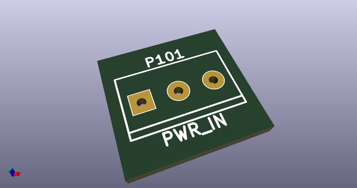
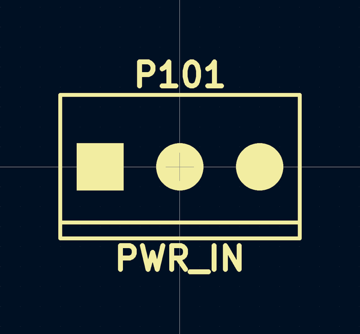
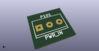
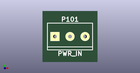

# OOMP Footprint  
## screw terminal:mors_3p  by alchy  
  
oomp key: oomp_alchy_spacestudio_components_kf301_3p  
  
source repo at: [http://github.com/alchy/spacestudio_components.pretty/blob/master/tmp/data//oomlout_oomp_footprint_src/trimmer_alps-rk09k1130ah1.kicad_mod](http://github.com/alchy/spacestudio_components.pretty/blob/master/tmp/data//oomlout_oomp_footprint_src/trimmer_alps-rk09k1130ah1.kicad_mod)  
## Footprint  
  
  
  
  
| name | value | 
| --- | --- | 
| footprint name | screw terminal:mors_3p | 
| footprint description | Terminal block 3 pins | 
| number of pads | 3 | 
| github path | http://github.com/alchy/spacestudio_components.pretty/blob/master/tmp/data//oomlout_oomp_footprint_src/KF301-3P.kicad_mod | 
| oomp key | oomp_alchy_spacestudio_components_kf301_3p | 
| oomp bot github | https://github.com/oomlout/oomlout_oomp_footprint_bot/tree/main/tmp/data//oomlout_oomp_footprint_src/footprints/alchy_spacestudio_components_kf301_3p/working | 
## Images  
  
  
  
  
  
  
  
  
