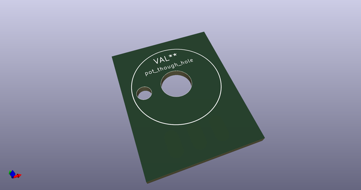
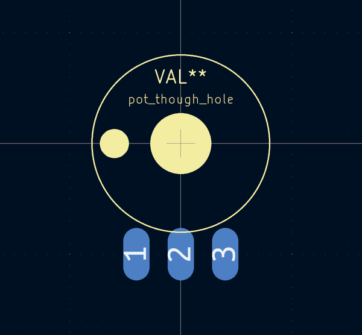
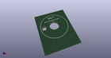

# OOMP Footprint  
## Spacestudio_Components:standard_pot  by alchy  
  
oomp key: oomp_alchy_spacestudio_components_pot_through_hole  
  
source repo at: [http://github.com/alchy/spacestudio_components.pretty/blob/master/tmp/data/oomlout_oomp_footprint_src/trimmer_alps-rk09k1130ah1.kicad_mod](http://github.com/alchy/spacestudio_components.pretty/blob/master/tmp/data/oomlout_oomp_footprint_src/trimmer_alps-rk09k1130ah1.kicad_mod)  
## Footprint  
  
  
  
  
| name | value | 
| --- | --- | 
| footprint name | Spacestudio_Components:standard_pot | 
| footprint description | None | 
| number of pads | 5 | 
| github path | http://github.com/alchy/spacestudio_components.pretty/blob/master/tmp/data/oomlout_oomp_footprint_src/pot_through_hole.kicad_mod | 
| oomp key | oomp_alchy_spacestudio_components_pot_through_hole | 
| oomp bot github | https://github.com/oomlout/oomlout_oomp_footprint_bot/tree/main/tmp/data/oomlout_oomp_footprint_src/footprints/alchy_spacestudio_components_pot_through_hole/working | 
## Images  
  
  
  
  
  
  
  
  
