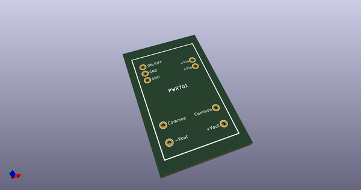
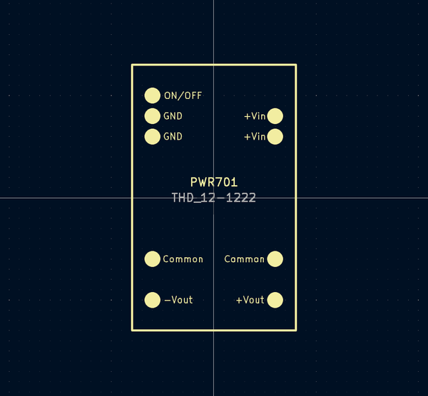
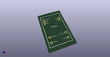
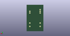
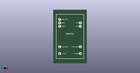

# OOMP Footprint  
## spacestudio_components:THD_12-1222  by none  
  
oomp key: oomp_alchy_spacestudio_components_thd_12_1222  
  
source repo at: [http://gitlab.com/alchy/spacestudio_components.pretty/blob/master/tmp/data//oomlout_oomp_footprint_src/trimmer_alps-rk09k1130ah1.kicad_mod](http://gitlab.com/alchy/spacestudio_components.pretty/blob/master/tmp/data//oomlout_oomp_footprint_src/trimmer_alps-rk09k1130ah1.kicad_mod)  
## Footprint  
  
  
  
  
| name | value | 
| --- | --- | 
| footprint name | spacestudio_components:THD_12-1222 | 
| footprint description | None | 
| number of pads | 9 | 
| github path | http://github.com/alchy/spacestudio_components.pretty/blob/master/tmp/data//oomlout_oomp_footprint_src/THD_12-1222.kicad_mod | 
| oomp key | oomp_alchy_spacestudio_components_thd_12_1222 | 
| oomp bot github | https://github.com/oomlout/oomlout_oomp_footprint_bot/tree/main/tmp/data//oomlout_oomp_footprint_src/footprints/alchy_spacestudio_components_thd_12_1222/working | 
## Images  
  
  
  
  
  
  
