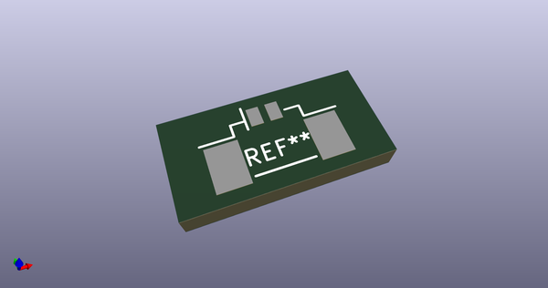
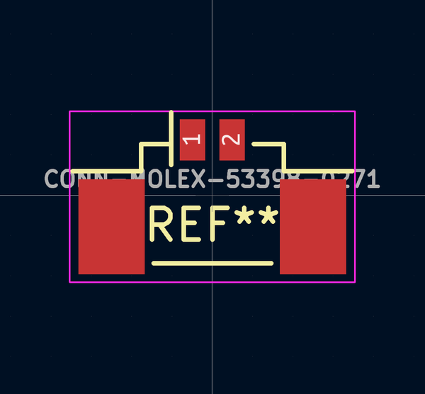
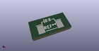
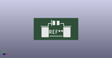

# OOMP Footprint  
## CONN-MOLEX-53398-0271  by alexisvl  
  
oomp key: oomp_alexisvl_conn_molex_conn_molex_53398_0271  
  
source repo at: [http://github.com/cpavlina/kicad-pcblib/blob/master/tmp/data/oomlout_oomp_footprint_src/smd-semi.pretty/VQFN50P230X230X100-12.kicad_mod](http://github.com/cpavlina/kicad-pcblib/blob/master/tmp/data/oomlout_oomp_footprint_src/smd-semi.pretty/VQFN50P230X230X100-12.kicad_mod)  
## Footprint  
  
  
  
  
| name | value | 
| --- | --- | 
| footprint name | CONN-MOLEX-53398-0271 | 
| footprint description | None | 
| number of pads | 4 | 
| github path | http://github.com/cpavlina/kicad-pcblib/blob/master/tmp/data/oomlout_oomp_footprint_src/conn-molex.pretty/CONN-MOLEX-53398-0271.kicad_mod | 
| oomp key | oomp_alexisvl_conn_molex_conn_molex_53398_0271 | 
| oomp bot github | https://github.com/oomlout/oomlout_oomp_footprint_bot/tree/main/tmp/data/oomlout_oomp_footprint_src/footprints/alexisvl_conn_molex_conn_molex_53398_0271/working | 
## Images  
  
  
  
  
  
  
