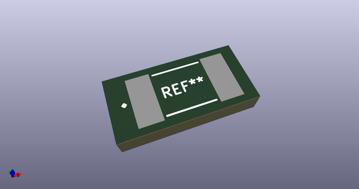
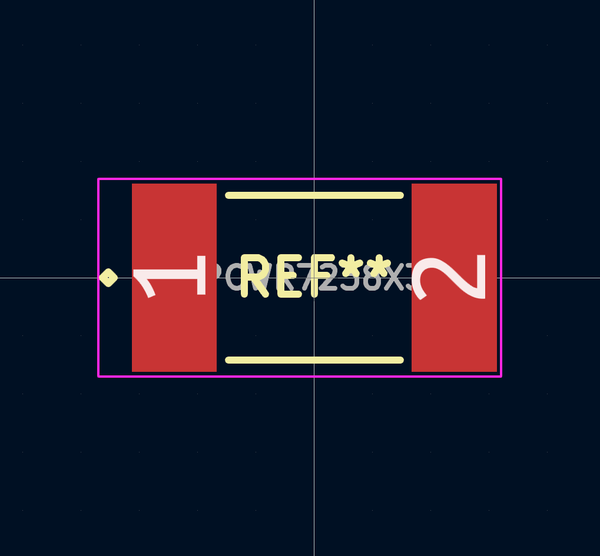
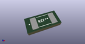

# OOMP Footprint  
## CAPCWR7238X317  by alexisvl  
  
oomp key: oomp_alexisvl_ipc7351_least_capcwr7238x317  
  
source repo at: [http://github.com/cpavlina/kicad-pcblib/blob/master/tmp/data//oomlout_oomp_footprint_src/smd-semi.pretty/VQFN50P230X230X100-12.kicad_mod](http://github.com/cpavlina/kicad-pcblib/blob/master/tmp/data//oomlout_oomp_footprint_src/smd-semi.pretty/VQFN50P230X230X100-12.kicad_mod)  
## Footprint  
  
  
  
  
| name | value | 
| --- | --- | 
| footprint name | CAPCWR7238X317 | 
| footprint description | Capacitor,wire-rect.,Chip;7.24mm L X 3.81mm W X 3.17mm H | 
| number of pads | 2 | 
| github path | http://github.com/cpavlina/kicad-pcblib/blob/master/tmp/data//oomlout_oomp_footprint_src/IPC7351-Least.pretty/CAPCWR7238X317.kicad_mod | 
| oomp key | oomp_alexisvl_ipc7351_least_capcwr7238x317 | 
| oomp bot github | https://github.com/oomlout/oomlout_oomp_footprint_bot/tree/main/tmp/data//oomlout_oomp_footprint_src/footprints/alexisvl_ipc7351_least_capcwr7238x317/working | 
## Images  
  
  
  
  
  
  
  
  
