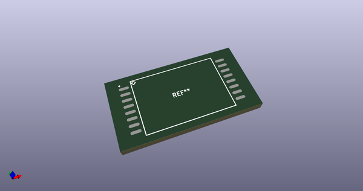
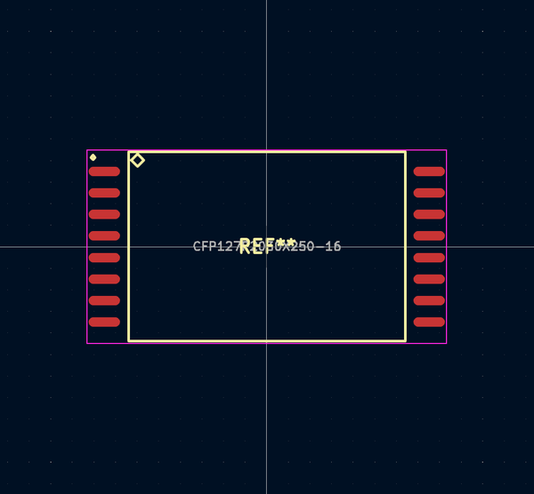
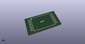
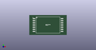

# OOMP Footprint  
## CFP127P2030X250-16  by alexisvl  
  
oomp key: oomp_alexisvl_ipc7351_least_cfp127p2030x250_16  
  
source repo at: [http://github.com/cpavlina/kicad-pcblib/blob/master/tmp/data//oomlout_oomp_footprint_src/smd-semi.pretty/VQFN50P230X230X100-12.kicad_mod](http://github.com/cpavlina/kicad-pcblib/blob/master/tmp/data//oomlout_oomp_footprint_src/smd-semi.pretty/VQFN50P230X230X100-12.kicad_mod)  
## Footprint  
  
  
  
  
| name | value | 
| --- | --- | 
| footprint name | CFP127P2030X250-16 | 
| footprint description | Ceramic Flat Pack,1.27mm pitch;16 pin,15.24mm W X 11.17mm L X 2.50mm H Body | 
| number of pads | 16 | 
| github path | http://github.com/cpavlina/kicad-pcblib/blob/master/tmp/data//oomlout_oomp_footprint_src/IPC7351-Least.pretty/CFP127P2030X250-16.kicad_mod | 
| oomp key | oomp_alexisvl_ipc7351_least_cfp127p2030x250_16 | 
| oomp bot github | https://github.com/oomlout/oomlout_oomp_footprint_bot/tree/main/tmp/data//oomlout_oomp_footprint_src/footprints/alexisvl_ipc7351_least_cfp127p2030x250_16/working | 
## Images  
  
  
  
  
  
  
  
  
