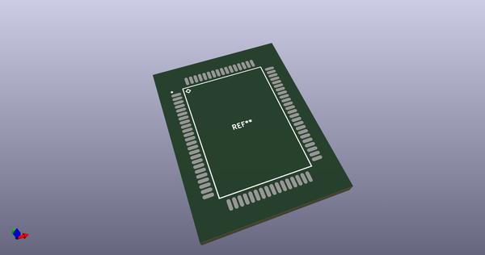
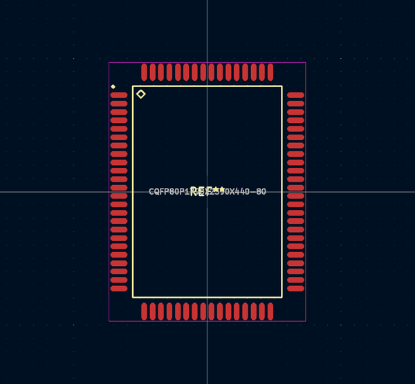
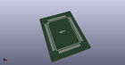
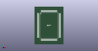

# OOMP Footprint  
## CQFP80P1790X2390X440-80  by alexisvl  
  
oomp key: oomp_alexisvl_ipc7351_least_cqfp80p1790x2390x440_80  
  
source repo at: [http://github.com/cpavlina/kicad-pcblib/blob/master/tmp/data//oomlout_oomp_footprint_src/smd-semi.pretty/VQFN50P230X230X100-12.kicad_mod](http://github.com/cpavlina/kicad-pcblib/blob/master/tmp/data//oomlout_oomp_footprint_src/smd-semi.pretty/VQFN50P230X230X100-12.kicad_mod)  
## Footprint  
  
  
  
  
| name | value | 
| --- | --- | 
| footprint name | CQFP80P1790X2390X440-80 | 
| footprint description | CQFP,0.80mm pitch,rect.;16 pin X 24 pin, 14.20mm X 20.20mm X 4.40mm H body | 
| number of pads | 80 | 
| github path | http://github.com/cpavlina/kicad-pcblib/blob/master/tmp/data//oomlout_oomp_footprint_src/IPC7351-Least.pretty/CQFP80P1790X2390X440-80.kicad_mod | 
| oomp key | oomp_alexisvl_ipc7351_least_cqfp80p1790x2390x440_80 | 
| oomp bot github | https://github.com/oomlout/oomlout_oomp_footprint_bot/tree/main/tmp/data//oomlout_oomp_footprint_src/footprints/alexisvl_ipc7351_least_cqfp80p1790x2390x440_80/working | 
## Images  
  
  
  
  
  
  
  
  
