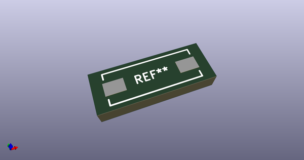
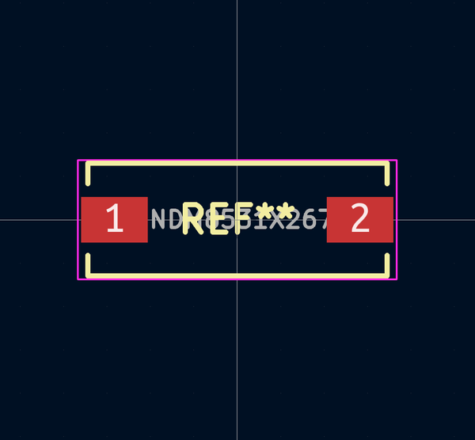
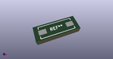

# OOMP Footprint  
## INDM8531X267  by alexisvl  
  
oomp key: oomp_alexisvl_ipc7351_least_indm8531x267  
  
source repo at: [http://github.com/cpavlina/kicad-pcblib/blob/master/tmp/data/oomlout_oomp_footprint_src/smd-semi.pretty/VQFN50P230X230X100-12.kicad_mod](http://github.com/cpavlina/kicad-pcblib/blob/master/tmp/data/oomlout_oomp_footprint_src/smd-semi.pretty/VQFN50P230X230X100-12.kicad_mod)  
## Footprint  
  
  
  
  
| name | value | 
| --- | --- | 
| footprint name | INDM8531X267 | 
| footprint description | Inductor,Molded Body;8.51mm L X 3.05mm W X 2.67mm H | 
| number of pads | 2 | 
| github path | http://github.com/cpavlina/kicad-pcblib/blob/master/tmp/data/oomlout_oomp_footprint_src/IPC7351-Least.pretty/INDM8531X267.kicad_mod | 
| oomp key | oomp_alexisvl_ipc7351_least_indm8531x267 | 
| oomp bot github | https://github.com/oomlout/oomlout_oomp_footprint_bot/tree/main/tmp/data/oomlout_oomp_footprint_src/footprints/alexisvl_ipc7351_least_indm8531x267/working | 
## Images  
  
  
  
  
  
  
  
  
