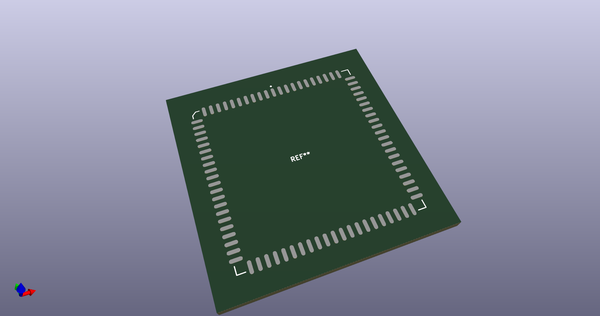
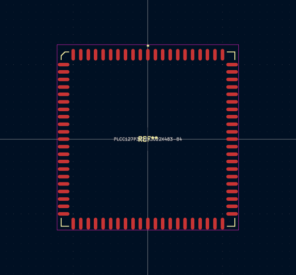
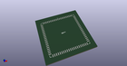
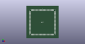

# OOMP Footprint  
## PLCC127P3022X3022X483-84  by alexisvl  
  
oomp key: oomp_alexisvl_ipc7351_least_plcc127p3022x3022x483_84  
  
source repo at: [http://github.com/cpavlina/kicad-pcblib/blob/master/tmp/data/oomlout_oomp_footprint_src/smd-semi.pretty/VQFN50P230X230X100-12.kicad_mod](http://github.com/cpavlina/kicad-pcblib/blob/master/tmp/data/oomlout_oomp_footprint_src/smd-semi.pretty/VQFN50P230X230X100-12.kicad_mod)  
## Footprint  
  
  
  
  
| name | value | 
| --- | --- | 
| footprint name | PLCC127P3022X3022X483-84 | 
| footprint description | PLCC,1.27mm pitch,square;21 pin X 21 pin, 29.59mm L X 29.59mm W X 4.83mm H body | 
| number of pads | 84 | 
| github path | http://github.com/cpavlina/kicad-pcblib/blob/master/tmp/data/oomlout_oomp_footprint_src/IPC7351-Least.pretty/PLCC127P3022X3022X483-84.kicad_mod | 
| oomp key | oomp_alexisvl_ipc7351_least_plcc127p3022x3022x483_84 | 
| oomp bot github | https://github.com/oomlout/oomlout_oomp_footprint_bot/tree/main/tmp/data/oomlout_oomp_footprint_src/footprints/alexisvl_ipc7351_least_plcc127p3022x3022x483_84/working | 
## Images  
  
  
  
  
  
  
  
  
