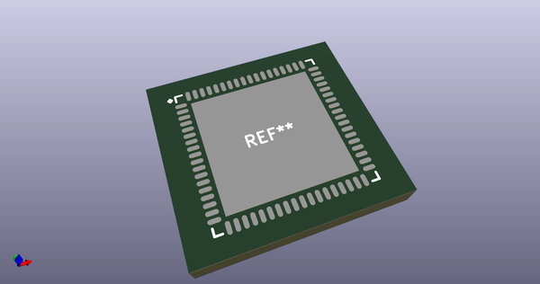
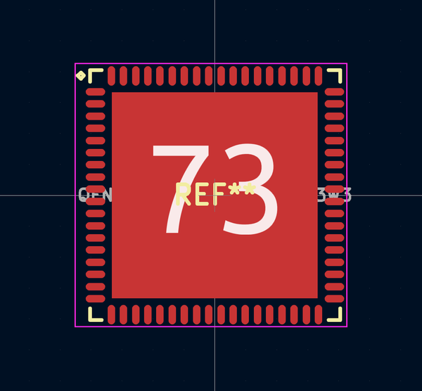
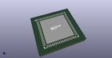
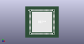

# OOMP Footprint  
## QFN50P1000X1000X80-73W3  by alexisvl  
  
oomp key: oomp_alexisvl_ipc7351_least_qfn50p1000x1000x80_73w3  
  
source repo at: [http://github.com/cpavlina/kicad-pcblib/blob/master/tmp/data//oomlout_oomp_footprint_src/smd-semi.pretty/VQFN50P230X230X100-12.kicad_mod](http://github.com/cpavlina/kicad-pcblib/blob/master/tmp/data//oomlout_oomp_footprint_src/smd-semi.pretty/VQFN50P230X230X100-12.kicad_mod)  
## Footprint  
  
  
  
  
| name | value | 
| --- | --- | 
| footprint name | QFN50P1000X1000X80-73W3 | 
| footprint description | QFN,0.50mm pitch,square;18 pin X 18 pin,10.00mm X 10.00mm X 0.80mm H (w/thermal tab) | 
| number of pads | 73 | 
| github path | http://github.com/cpavlina/kicad-pcblib/blob/master/tmp/data//oomlout_oomp_footprint_src/IPC7351-Least.pretty/QFN50P1000X1000X80-73W3.kicad_mod | 
| oomp key | oomp_alexisvl_ipc7351_least_qfn50p1000x1000x80_73w3 | 
| oomp bot github | https://github.com/oomlout/oomlout_oomp_footprint_bot/tree/main/tmp/data//oomlout_oomp_footprint_src/footprints/alexisvl_ipc7351_least_qfn50p1000x1000x80_73w3/working | 
## Images  
  
  
  
  
  
  
  
  
