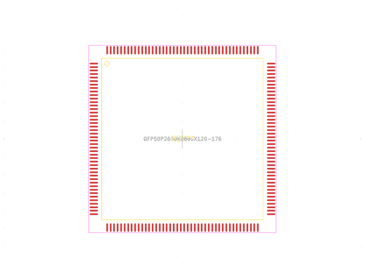
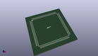
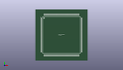

# OOMP Footprint  
## QFP50P2600X2600X120-176  by alexisvl  
  
oomp key: oomp_alexisvl_ipc7351_least_qfp50p2600x2600x120_176  
  
source repo at: [http://github.com/cpavlina/kicad-pcblib/blob/master/tmp/data//oomlout_oomp_footprint_src/smd-semi.pretty/VQFN50P230X230X100-12.kicad_mod](http://github.com/cpavlina/kicad-pcblib/blob/master/tmp/data//oomlout_oomp_footprint_src/smd-semi.pretty/VQFN50P230X230X100-12.kicad_mod)  
## Footprint  
  
  
  
  
| name | value | 
| --- | --- | 
| footprint name | QFP50P2600X2600X120-176 | 
| footprint description | QFP,0.50mm pitch,square;44 pin X 44 pin,24.00mm X 24.00mm X 1.20mm H Body | 
| number of pads | 176 | 
| github path | http://github.com/cpavlina/kicad-pcblib/blob/master/tmp/data//oomlout_oomp_footprint_src/IPC7351-Least.pretty/QFP50P2600X2600X120-176.kicad_mod | 
| oomp key | oomp_alexisvl_ipc7351_least_qfp50p2600x2600x120_176 | 
| oomp bot github | https://github.com/oomlout/oomlout_oomp_footprint_bot/tree/main/tmp/data//oomlout_oomp_footprint_src/footprints/alexisvl_ipc7351_least_qfp50p2600x2600x120_176/working | 
## Images  
  
  
  
  
  
  
