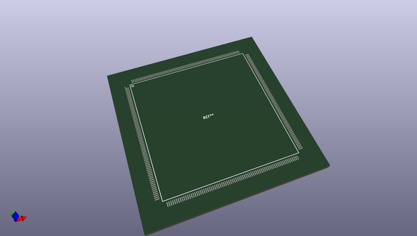
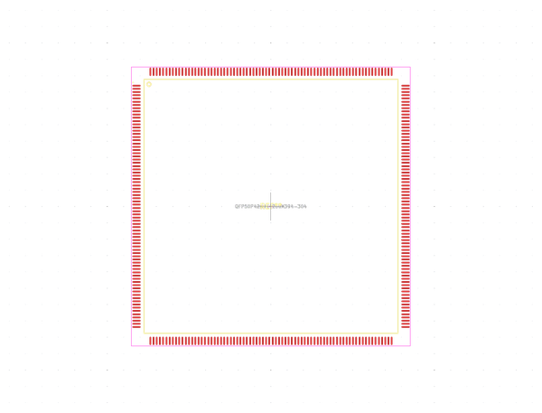
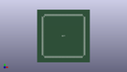

# OOMP Footprint  
## QFP50P4260X4260X394-304  by alexisvl  
  
oomp key: oomp_alexisvl_ipc7351_least_qfp50p4260x4260x394_304  
  
source repo at: [http://github.com/cpavlina/kicad-pcblib/blob/master/tmp/data//oomlout_oomp_footprint_src/smd-semi.pretty/VQFN50P230X230X100-12.kicad_mod](http://github.com/cpavlina/kicad-pcblib/blob/master/tmp/data//oomlout_oomp_footprint_src/smd-semi.pretty/VQFN50P230X230X100-12.kicad_mod)  
## Footprint  
  
  
  
  
| name | value | 
| --- | --- | 
| footprint name | QFP50P4260X4260X394-304 | 
| footprint description | QFP,0.50mm pitch,square;76 pin X 76 pin, 39.79mm X 39.79mm X 3.94mm H Body | 
| number of pads | 304 | 
| github path | http://github.com/cpavlina/kicad-pcblib/blob/master/tmp/data//oomlout_oomp_footprint_src/IPC7351-Least.pretty/QFP50P4260X4260X394-304.kicad_mod | 
| oomp key | oomp_alexisvl_ipc7351_least_qfp50p4260x4260x394_304 | 
| oomp bot github | https://github.com/oomlout/oomlout_oomp_footprint_bot/tree/main/tmp/data//oomlout_oomp_footprint_src/footprints/alexisvl_ipc7351_least_qfp50p4260x4260x394_304/working | 
## Images  
  
  
  
  
  
  
