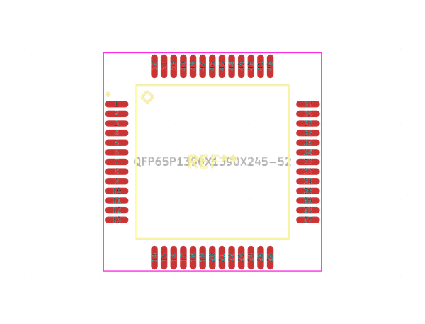
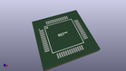
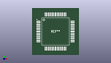

# OOMP Footprint  
## QFP65P1390X1390X245-52  by alexisvl  
  
oomp key: oomp_alexisvl_ipc7351_least_qfp65p1390x1390x245_52  
  
source repo at: [http://github.com/cpavlina/kicad-pcblib/blob/master/tmp/data//oomlout_oomp_footprint_src/smd-semi.pretty/VQFN50P230X230X100-12.kicad_mod](http://github.com/cpavlina/kicad-pcblib/blob/master/tmp/data//oomlout_oomp_footprint_src/smd-semi.pretty/VQFN50P230X230X100-12.kicad_mod)  
## Footprint  
  
  
  
  
| name | value | 
| --- | --- | 
| footprint name | QFP65P1390X1390X245-52 | 
| footprint description | QFP,0.65mm pitch,square;13 pin X 13 pin, 10.00mm X 10.00mm X 2.45mm H body | 
| number of pads | 52 | 
| github path | http://github.com/cpavlina/kicad-pcblib/blob/master/tmp/data//oomlout_oomp_footprint_src/IPC7351-Least.pretty/QFP65P1390X1390X245-52.kicad_mod | 
| oomp key | oomp_alexisvl_ipc7351_least_qfp65p1390x1390x245_52 | 
| oomp bot github | https://github.com/oomlout/oomlout_oomp_footprint_bot/tree/main/tmp/data//oomlout_oomp_footprint_src/footprints/alexisvl_ipc7351_least_qfp65p1390x1390x245_52/working | 
## Images  
  
  
  
  
  
  
  
  
