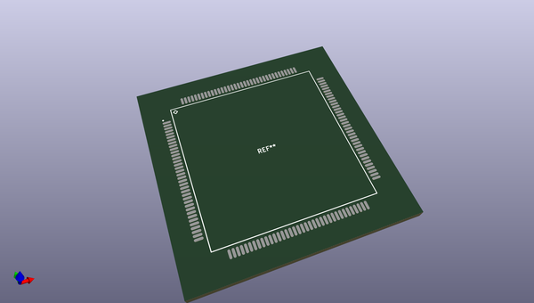
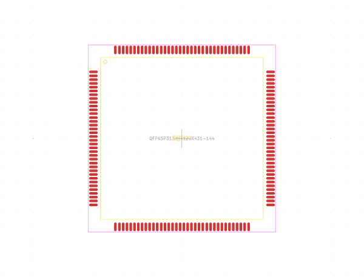
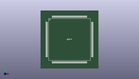

# OOMP Footprint  
## QFP65P3120X3120X431-144  by alexisvl  
  
oomp key: oomp_alexisvl_ipc7351_least_qfp65p3120x3120x431_144  
  
source repo at: [http://github.com/cpavlina/kicad-pcblib/blob/master/tmp/data/oomlout_oomp_footprint_src/smd-semi.pretty/VQFN50P230X230X100-12.kicad_mod](http://github.com/cpavlina/kicad-pcblib/blob/master/tmp/data/oomlout_oomp_footprint_src/smd-semi.pretty/VQFN50P230X230X100-12.kicad_mod)  
## Footprint  
  
  
  
  
| name | value | 
| --- | --- | 
| footprint name | QFP65P3120X3120X431-144 | 
| footprint description | QFP,0.65mm pitch,square;36 pin X 36 pin, 26.77mm X 26.77mm X 4.31mm H body | 
| number of pads | 144 | 
| github path | http://github.com/cpavlina/kicad-pcblib/blob/master/tmp/data/oomlout_oomp_footprint_src/IPC7351-Least.pretty/QFP65P3120X3120X431-144.kicad_mod | 
| oomp key | oomp_alexisvl_ipc7351_least_qfp65p3120x3120x431_144 | 
| oomp bot github | https://github.com/oomlout/oomlout_oomp_footprint_bot/tree/main/tmp/data/oomlout_oomp_footprint_src/footprints/alexisvl_ipc7351_least_qfp65p3120x3120x431_144/working | 
## Images  
  
  
  
  
  
  
