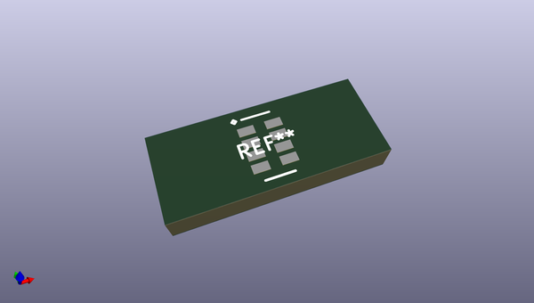
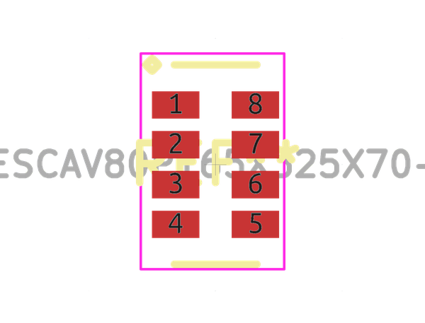
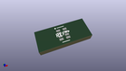

# OOMP Footprint  
## RESCAV80P165X325X70-8  by alexisvl  
  
oomp key: oomp_alexisvl_ipc7351_least_rescav80p165x325x70_8  
  
source repo at: [http://github.com/cpavlina/kicad-pcblib/blob/master/tmp/data/oomlout_oomp_footprint_src/smd-semi.pretty/VQFN50P230X230X100-12.kicad_mod](http://github.com/cpavlina/kicad-pcblib/blob/master/tmp/data/oomlout_oomp_footprint_src/smd-semi.pretty/VQFN50P230X230X100-12.kicad_mod)  
## Footprint  
  
  
  
  
| name | value | 
| --- | --- | 
| footprint name | RESCAV80P165X325X70-8 | 
| footprint description | Resistor,Chip Array,0.80mm pitch;8 pin,1.65mm L X 3.25mm W X 0.70mm H | 
| number of pads | 8 | 
| github path | http://github.com/cpavlina/kicad-pcblib/blob/master/tmp/data/oomlout_oomp_footprint_src/IPC7351-Least.pretty/RESCAV80P165X325X70-8.kicad_mod | 
| oomp key | oomp_alexisvl_ipc7351_least_rescav80p165x325x70_8 | 
| oomp bot github | https://github.com/oomlout/oomlout_oomp_footprint_bot/tree/main/tmp/data/oomlout_oomp_footprint_src/footprints/alexisvl_ipc7351_least_rescav80p165x325x70_8/working | 
## Images  
  
  
  
  
  
  
  
  
