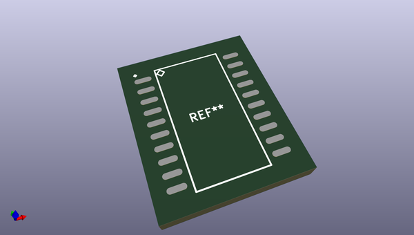
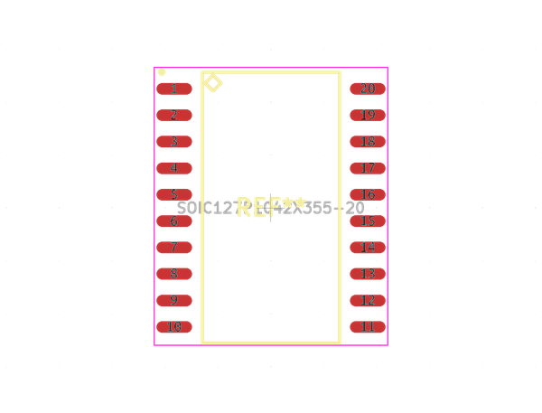
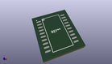
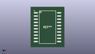

# OOMP Footprint  
## SOIC127P1042X355-20  by alexisvl  
  
oomp key: oomp_alexisvl_ipc7351_least_soic127p1042x355_20  
  
source repo at: [http://github.com/cpavlina/kicad-pcblib/blob/master/tmp/data/oomlout_oomp_footprint_src/smd-semi.pretty/VQFN50P230X230X100-12.kicad_mod](http://github.com/cpavlina/kicad-pcblib/blob/master/tmp/data/oomlout_oomp_footprint_src/smd-semi.pretty/VQFN50P230X230X100-12.kicad_mod)  
## Footprint  
  
  
  
  
| name | value | 
| --- | --- | 
| footprint name | SOIC127P1042X355-20 | 
| footprint description | SOIC,1.27mm pitch;20 pin,7.60mm W X 13.00mm L X 3.55mm H body | 
| number of pads | 20 | 
| github path | http://github.com/cpavlina/kicad-pcblib/blob/master/tmp/data/oomlout_oomp_footprint_src/IPC7351-Least.pretty/SOIC127P1042X355-20.kicad_mod | 
| oomp key | oomp_alexisvl_ipc7351_least_soic127p1042x355_20 | 
| oomp bot github | https://github.com/oomlout/oomlout_oomp_footprint_bot/tree/main/tmp/data/oomlout_oomp_footprint_src/footprints/alexisvl_ipc7351_least_soic127p1042x355_20/working | 
## Images  
  
  
  
  
  
  
  
  
