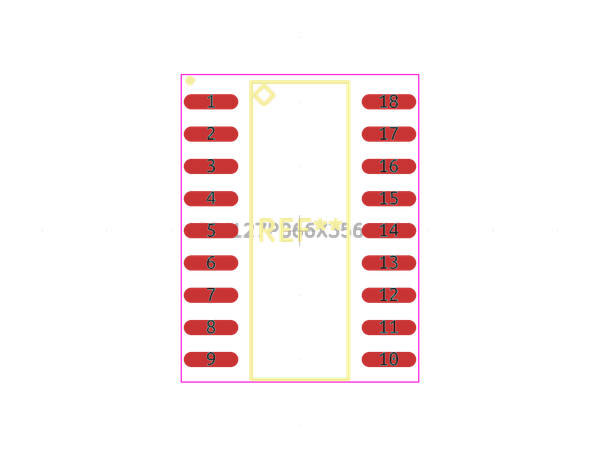
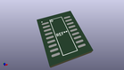
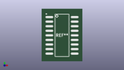

# OOMP Footprint  
## SOJ127P866X356-18  by alexisvl  
  
oomp key: oomp_alexisvl_ipc7351_least_soj127p866x356_18  
  
source repo at: [http://github.com/cpavlina/kicad-pcblib/blob/master/tmp/data//oomlout_oomp_footprint_src/smd-semi.pretty/VQFN50P230X230X100-12.kicad_mod](http://github.com/cpavlina/kicad-pcblib/blob/master/tmp/data//oomlout_oomp_footprint_src/smd-semi.pretty/VQFN50P230X230X100-12.kicad_mod)  
## Footprint  
  
  
  
  
| name | value | 
| --- | --- | 
| footprint name | SOJ127P866X356-18 | 
| footprint description | SO J-Lead,1.27mm pitch (300mil Body);18 pin,7.62mm W X 11.73mm L X 3.56mm H Body | 
| number of pads | 18 | 
| github path | http://github.com/cpavlina/kicad-pcblib/blob/master/tmp/data//oomlout_oomp_footprint_src/IPC7351-Least.pretty/SOJ127P866X356-18.kicad_mod | 
| oomp key | oomp_alexisvl_ipc7351_least_soj127p866x356_18 | 
| oomp bot github | https://github.com/oomlout/oomlout_oomp_footprint_bot/tree/main/tmp/data//oomlout_oomp_footprint_src/footprints/alexisvl_ipc7351_least_soj127p866x356_18/working | 
## Images  
  
  
  
  
  
  
  
  
