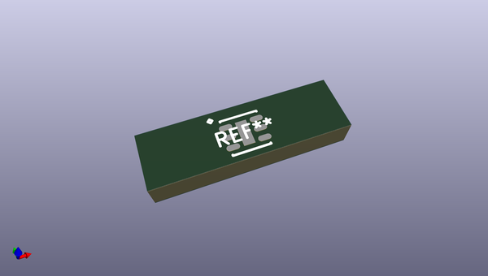
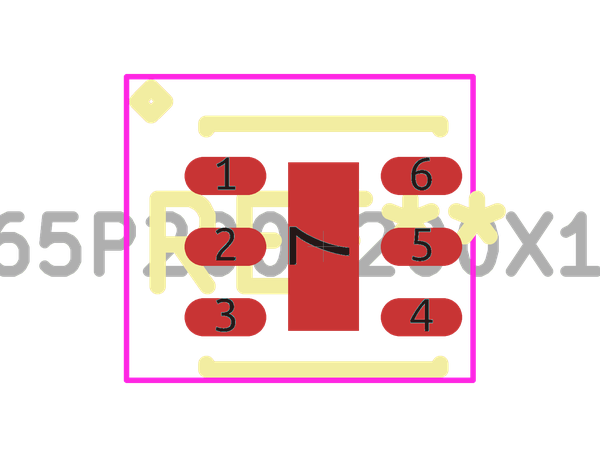
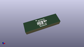

# OOMP Footprint  
## SON65P200X200X100-7  by alexisvl  
  
oomp key: oomp_alexisvl_ipc7351_least_son65p200x200x100_7  
  
source repo at: [http://github.com/cpavlina/kicad-pcblib/blob/master/tmp/data//oomlout_oomp_footprint_src/smd-semi.pretty/VQFN50P230X230X100-12.kicad_mod](http://github.com/cpavlina/kicad-pcblib/blob/master/tmp/data//oomlout_oomp_footprint_src/smd-semi.pretty/VQFN50P230X230X100-12.kicad_mod)  
## Footprint  
  
  
  
  
| name | value | 
| --- | --- | 
| footprint name | SON65P200X200X100-7 | 
| footprint description | SON,0.65mm pitch;6 pin,2.15mm W X 2.00mm L X 1.00mm H body (w/thermal tab) | 
| number of pads | 7 | 
| github path | http://github.com/cpavlina/kicad-pcblib/blob/master/tmp/data//oomlout_oomp_footprint_src/IPC7351-Least.pretty/SON65P200X200X100-7.kicad_mod | 
| oomp key | oomp_alexisvl_ipc7351_least_son65p200x200x100_7 | 
| oomp bot github | https://github.com/oomlout/oomlout_oomp_footprint_bot/tree/main/tmp/data//oomlout_oomp_footprint_src/footprints/alexisvl_ipc7351_least_son65p200x200x100_7/working | 
## Images  
  
  
  
  
  
  
  
  
