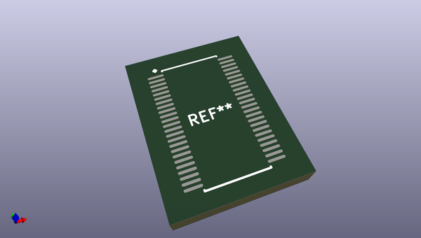
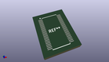
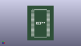

# OOMP Footprint  
## SOP40P640X120-48  by alexisvl  
  
oomp key: oomp_alexisvl_ipc7351_least_sop40p640x120_48  
  
source repo at: [http://github.com/cpavlina/kicad-pcblib/blob/master/tmp/data/oomlout_oomp_footprint_src/smd-semi.pretty/VQFN50P230X230X100-12.kicad_mod](http://github.com/cpavlina/kicad-pcblib/blob/master/tmp/data/oomlout_oomp_footprint_src/smd-semi.pretty/VQFN50P230X230X100-12.kicad_mod)  
## Footprint  
  
  
  
  
| name | value | 
| --- | --- | 
| footprint name | SOP40P640X120-48 | 
| footprint description | SOP,0.40mm pitch;48 pin,4.50mm W X 9.80mm L X 1.20mm H Body | 
| number of pads | 48 | 
| github path | http://github.com/cpavlina/kicad-pcblib/blob/master/tmp/data/oomlout_oomp_footprint_src/IPC7351-Least.pretty/SOP40P640X120-48.kicad_mod | 
| oomp key | oomp_alexisvl_ipc7351_least_sop40p640x120_48 | 
| oomp bot github | https://github.com/oomlout/oomlout_oomp_footprint_bot/tree/main/tmp/data/oomlout_oomp_footprint_src/footprints/alexisvl_ipc7351_least_sop40p640x120_48/working | 
## Images  
  
  
  
  
  
  
  
  
