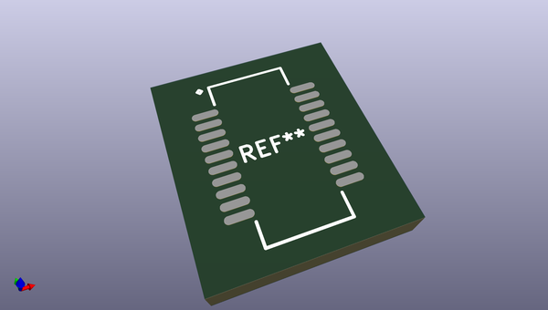
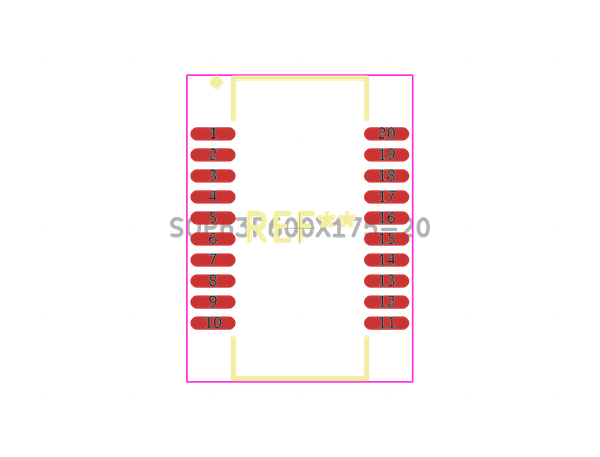
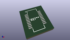
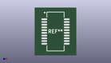

# OOMP Footprint  
## SOP63P600X175-20  by alexisvl  
  
oomp key: oomp_alexisvl_ipc7351_least_sop63p600x175_20  
  
source repo at: [http://github.com/cpavlina/kicad-pcblib/blob/master/tmp/data/oomlout_oomp_footprint_src/smd-semi.pretty/VQFN50P230X230X100-12.kicad_mod](http://github.com/cpavlina/kicad-pcblib/blob/master/tmp/data/oomlout_oomp_footprint_src/smd-semi.pretty/VQFN50P230X230X100-12.kicad_mod)  
## Footprint  
  
  
  
  
| name | value | 
| --- | --- | 
| footprint name | SOP63P600X175-20 | 
| footprint description | SOP,0.635mm pitch;20 pin,3.99mm W X 8.74mm L X 1.75mm H Body | 
| number of pads | 20 | 
| github path | http://github.com/cpavlina/kicad-pcblib/blob/master/tmp/data/oomlout_oomp_footprint_src/IPC7351-Least.pretty/SOP63P600X175-20.kicad_mod | 
| oomp key | oomp_alexisvl_ipc7351_least_sop63p600x175_20 | 
| oomp bot github | https://github.com/oomlout/oomlout_oomp_footprint_bot/tree/main/tmp/data/oomlout_oomp_footprint_src/footprints/alexisvl_ipc7351_least_sop63p600x175_20/working | 
## Images  
  
  
  
  
  
  
  
  
