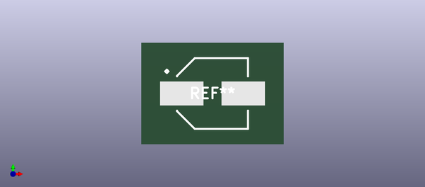
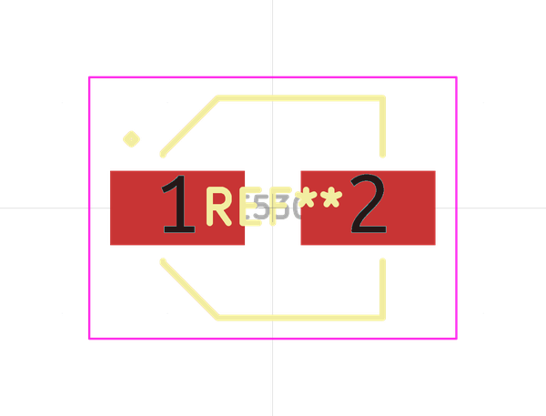

# OOMP Footprint  
## CAPAE660X460  by alexisvl  
  
oomp key: oomp_alexisvl_ipc7351_most_capae660x460  
  
source repo at: [http://github.com/cpavlina/kicad-pcblib/blob/master/tmp/data/oomlout_oomp_footprint_src/smd-semi.pretty/VQFN50P230X230X100-12.kicad_mod](http://github.com/cpavlina/kicad-pcblib/blob/master/tmp/data/oomlout_oomp_footprint_src/smd-semi.pretty/VQFN50P230X230X100-12.kicad_mod)  
## Footprint  
  
  
  
  
| name | value | 
| --- | --- | 
| footprint name | CAPAE660X460 | 
| footprint description | Capacitor,Aluminum Electrolytic;6.60mm L X 6.60mm W X 4.60mm H | 
| number of pads | 2 | 
| github path | http://github.com/cpavlina/kicad-pcblib/blob/master/tmp/data/oomlout_oomp_footprint_src/IPC7351-Most.pretty/CAPAE660X460.kicad_mod | 
| oomp key | oomp_alexisvl_ipc7351_most_capae660x460 | 
| oomp bot github | https://github.com/oomlout/oomlout_oomp_footprint_bot/tree/main/tmp/data/oomlout_oomp_footprint_src/footprints/alexisvl_ipc7351_most_capae660x460/working | 
## Images  
  
  
  
  
  
  
  
  
