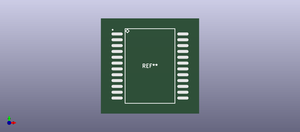
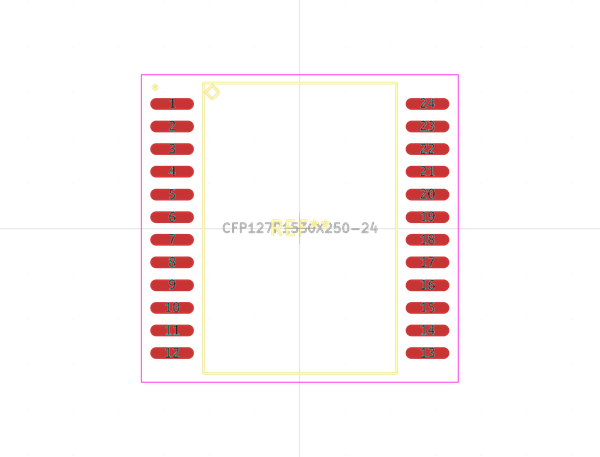

# OOMP Footprint  
## CFP127P1530X250-28  by alexisvl  
  
oomp key: oomp_alexisvl_ipc7351_most_cfp127p1530x250_28  
  
source repo at: [http://github.com/cpavlina/kicad-pcblib/blob/master/tmp/data//oomlout_oomp_footprint_src/smd-semi.pretty/VQFN50P230X230X100-12.kicad_mod](http://github.com/cpavlina/kicad-pcblib/blob/master/tmp/data//oomlout_oomp_footprint_src/smd-semi.pretty/VQFN50P230X230X100-12.kicad_mod)  
## Footprint  
  
  
  
  
| name | value | 
| --- | --- | 
| footprint name | CFP127P1530X250-28 | 
| footprint description | Ceramic Flat Pack,1.27mm pitch;28 pin,10.16mm W X 18.79mm L X 2.50mm H Body | 
| number of pads | 28 | 
| github path | http://github.com/cpavlina/kicad-pcblib/blob/master/tmp/data//oomlout_oomp_footprint_src/IPC7351-Most.pretty/CFP127P1530X250-28.kicad_mod | 
| oomp key | oomp_alexisvl_ipc7351_most_cfp127p1530x250_28 | 
| oomp bot github | https://github.com/oomlout/oomlout_oomp_footprint_bot/tree/main/tmp/data//oomlout_oomp_footprint_src/footprints/alexisvl_ipc7351_most_cfp127p1530x250_28/working | 
## Images  
  
  
  
  
  
  
  
  
