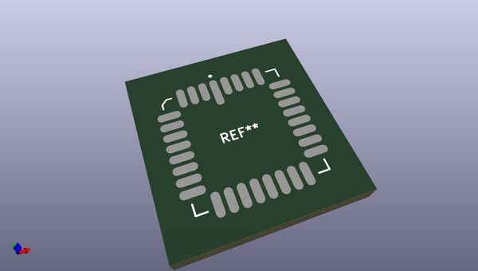
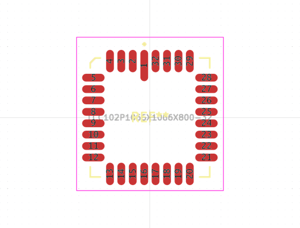
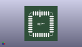

# OOMP Footprint  
## LCC102P1066X1066X800-32  by alexisvl  
  
oomp key: oomp_alexisvl_ipc7351_most_lcc102p1066x1066x800_32  
  
source repo at: [http://github.com/cpavlina/kicad-pcblib/blob/master/tmp/data//oomlout_oomp_footprint_src/smd-semi.pretty/VQFN50P230X230X100-12.kicad_mod](http://github.com/cpavlina/kicad-pcblib/blob/master/tmp/data//oomlout_oomp_footprint_src/smd-semi.pretty/VQFN50P230X230X100-12.kicad_mod)  
## Footprint  
  
  
  
  
| name | value | 
| --- | --- | 
| footprint name | LCC102P1066X1066X800-32 | 
| footprint description | LCC,1.015mm pitch,square;8 pin X 8 pin, 10.66mm X 10.66mm X 8.00mm H | 
| number of pads | 32 | 
| github path | http://github.com/cpavlina/kicad-pcblib/blob/master/tmp/data//oomlout_oomp_footprint_src/IPC7351-Most.pretty/LCC102P1066X1066X800-32.kicad_mod | 
| oomp key | oomp_alexisvl_ipc7351_most_lcc102p1066x1066x800_32 | 
| oomp bot github | https://github.com/oomlout/oomlout_oomp_footprint_bot/tree/main/tmp/data//oomlout_oomp_footprint_src/footprints/alexisvl_ipc7351_most_lcc102p1066x1066x800_32/working | 
## Images  
  
  
  
  
  
  
  
  
