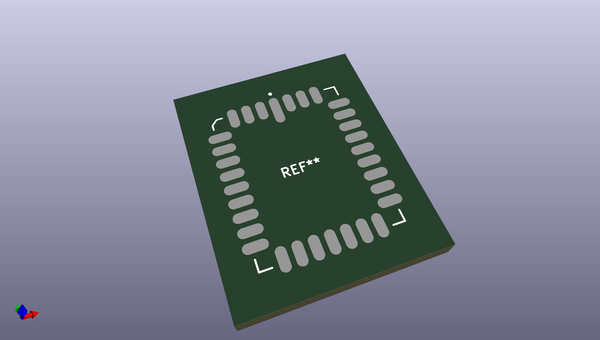
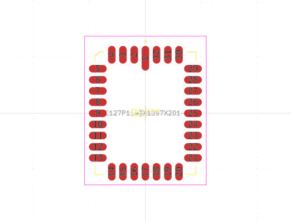
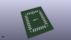
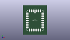

# OOMP Footprint  
## LCC127P1143X1397X201-32  by alexisvl  
  
oomp key: oomp_alexisvl_ipc7351_most_lcc127p1143x1397x201_32  
  
source repo at: [http://github.com/cpavlina/kicad-pcblib/blob/master/tmp/data/oomlout_oomp_footprint_src/smd-semi.pretty/VQFN50P230X230X100-12.kicad_mod](http://github.com/cpavlina/kicad-pcblib/blob/master/tmp/data/oomlout_oomp_footprint_src/smd-semi.pretty/VQFN50P230X230X100-12.kicad_mod)  
## Footprint  
  
  
  
  
| name | value | 
| --- | --- | 
| footprint name | LCC127P1143X1397X201-32 | 
| footprint description | LCC,1.27mm pitch,rect.;7 pin X 9 pin, 11.43mm X 13.97mm X 2.01mm H | 
| number of pads | 32 | 
| github path | http://github.com/cpavlina/kicad-pcblib/blob/master/tmp/data/oomlout_oomp_footprint_src/IPC7351-Most.pretty/LCC127P1143X1397X201-32.kicad_mod | 
| oomp key | oomp_alexisvl_ipc7351_most_lcc127p1143x1397x201_32 | 
| oomp bot github | https://github.com/oomlout/oomlout_oomp_footprint_bot/tree/main/tmp/data/oomlout_oomp_footprint_src/footprints/alexisvl_ipc7351_most_lcc127p1143x1397x201_32/working | 
## Images  
  
  
  
  
  
  
  
  
