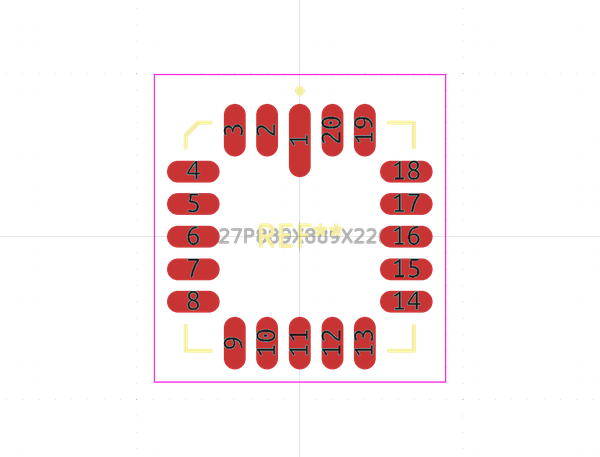
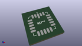
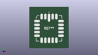

# OOMP Footprint  
## LCC127P889X889X226-20  by alexisvl  
  
oomp key: oomp_alexisvl_ipc7351_most_lcc127p889x889x226_20  
  
source repo at: [http://github.com/cpavlina/kicad-pcblib/blob/master/tmp/data//oomlout_oomp_footprint_src/smd-semi.pretty/VQFN50P230X230X100-12.kicad_mod](http://github.com/cpavlina/kicad-pcblib/blob/master/tmp/data//oomlout_oomp_footprint_src/smd-semi.pretty/VQFN50P230X230X100-12.kicad_mod)  
## Footprint  
  
  
  
  
| name | value | 
| --- | --- | 
| footprint name | LCC127P889X889X226-20 | 
| footprint description | LCC,1.27mm pitch,square;5 pin X 5 pin, 8.89mm X 8.89mm X 2.26mm H | 
| number of pads | 20 | 
| github path | http://github.com/cpavlina/kicad-pcblib/blob/master/tmp/data//oomlout_oomp_footprint_src/IPC7351-Most.pretty/LCC127P889X889X226-20.kicad_mod | 
| oomp key | oomp_alexisvl_ipc7351_most_lcc127p889x889x226_20 | 
| oomp bot github | https://github.com/oomlout/oomlout_oomp_footprint_bot/tree/main/tmp/data//oomlout_oomp_footprint_src/footprints/alexisvl_ipc7351_most_lcc127p889x889x226_20/working | 
## Images  
  
  
  
  
  
  
  
  
