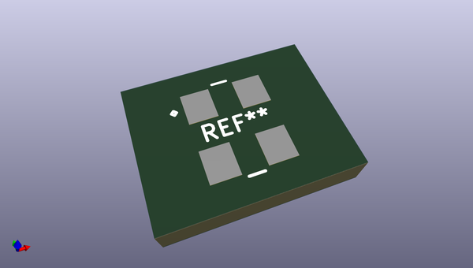
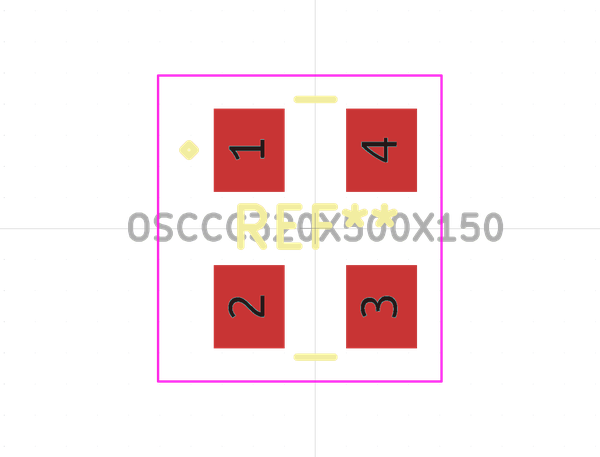
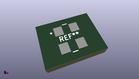

# OOMP Footprint  
## OSCCC320X500X150  by alexisvl  
  
oomp key: oomp_alexisvl_ipc7351_most_osccc320x500x150  
  
source repo at: [http://github.com/cpavlina/kicad-pcblib/blob/master/tmp/data/oomlout_oomp_footprint_src/smd-semi.pretty/VQFN50P230X230X100-12.kicad_mod](http://github.com/cpavlina/kicad-pcblib/blob/master/tmp/data/oomlout_oomp_footprint_src/smd-semi.pretty/VQFN50P230X230X100-12.kicad_mod)  
## Footprint  
  
  
  
  
| name | value | 
| --- | --- | 
| footprint name | OSCCC320X500X150 | 
| footprint description | Oscillator,corner,concave;3.20mm L X 5.00mm W X 1.50mm H | 
| number of pads | 4 | 
| github path | http://github.com/cpavlina/kicad-pcblib/blob/master/tmp/data/oomlout_oomp_footprint_src/IPC7351-Most.pretty/OSCCC320X500X150.kicad_mod | 
| oomp key | oomp_alexisvl_ipc7351_most_osccc320x500x150 | 
| oomp bot github | https://github.com/oomlout/oomlout_oomp_footprint_bot/tree/main/tmp/data/oomlout_oomp_footprint_src/footprints/alexisvl_ipc7351_most_osccc320x500x150/working | 
## Images  
  
  
  
  
  
  
  
  
