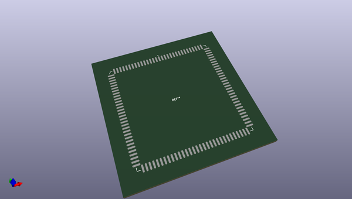
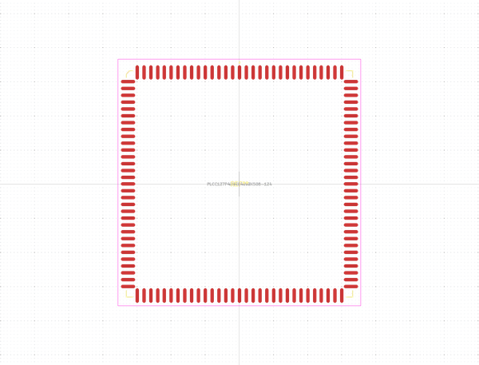
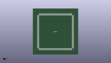

# OOMP Footprint  
## PLCC127P4292X4292X508-124  by alexisvl  
  
oomp key: oomp_alexisvl_ipc7351_most_plcc127p4292x4292x508_124  
  
source repo at: [http://github.com/cpavlina/kicad-pcblib/blob/master/tmp/data//oomlout_oomp_footprint_src/smd-semi.pretty/VQFN50P230X230X100-12.kicad_mod](http://github.com/cpavlina/kicad-pcblib/blob/master/tmp/data//oomlout_oomp_footprint_src/smd-semi.pretty/VQFN50P230X230X100-12.kicad_mod)  
## Footprint  
  
  
  
  
| name | value | 
| --- | --- | 
| footprint name | PLCC127P4292X4292X508-124 | 
| footprint description | PLCC,1.27mm Pitch,square;31 pin X 31 pin,42.11mm X 42.11mm X 5.08mm H Body | 
| number of pads | 124 | 
| github path | http://github.com/cpavlina/kicad-pcblib/blob/master/tmp/data//oomlout_oomp_footprint_src/IPC7351-Most.pretty/PLCC127P4292X4292X508-124.kicad_mod | 
| oomp key | oomp_alexisvl_ipc7351_most_plcc127p4292x4292x508_124 | 
| oomp bot github | https://github.com/oomlout/oomlout_oomp_footprint_bot/tree/main/tmp/data//oomlout_oomp_footprint_src/footprints/alexisvl_ipc7351_most_plcc127p4292x4292x508_124/working | 
## Images  
  
  
  
  
  
  
