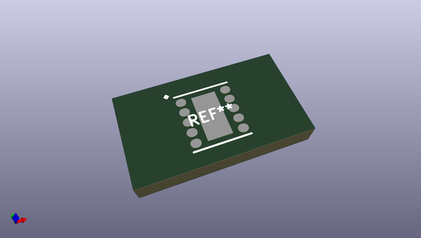
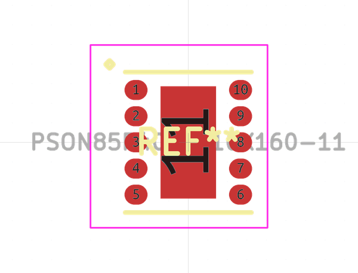
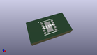

# OOMP Footprint  
## PSON85P403X410X160-11  by alexisvl  
  
oomp key: oomp_alexisvl_ipc7351_most_pson85p403x410x160_11  
  
source repo at: [http://github.com/cpavlina/kicad-pcblib/blob/master/tmp/data/oomlout_oomp_footprint_src/smd-semi.pretty/VQFN50P230X230X100-12.kicad_mod](http://github.com/cpavlina/kicad-pcblib/blob/master/tmp/data/oomlout_oomp_footprint_src/smd-semi.pretty/VQFN50P230X230X100-12.kicad_mod)  
## Footprint  
  
  
  
  
| name | value | 
| --- | --- | 
| footprint name | PSON85P403X410X160-11 | 
| footprint description | PSON,0.85mm pitch;10 pin,4.10mm W X 4.10mm L X 1.60mm H body (pullback leads) (w/thermal tab) | 
| number of pads | 11 | 
| github path | http://github.com/cpavlina/kicad-pcblib/blob/master/tmp/data/oomlout_oomp_footprint_src/IPC7351-Most.pretty/PSON85P403X410X160-11.kicad_mod | 
| oomp key | oomp_alexisvl_ipc7351_most_pson85p403x410x160_11 | 
| oomp bot github | https://github.com/oomlout/oomlout_oomp_footprint_bot/tree/main/tmp/data/oomlout_oomp_footprint_src/footprints/alexisvl_ipc7351_most_pson85p403x410x160_11/working | 
## Images  
  
  
  
  
  
  
  
  
