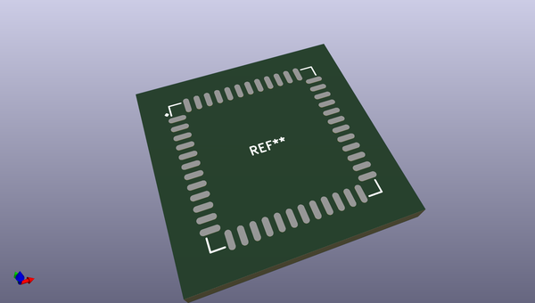
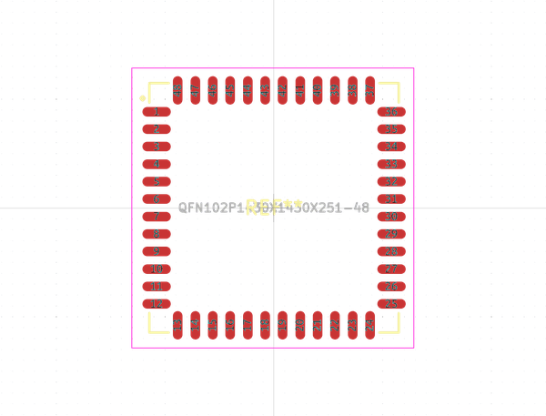
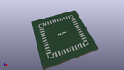
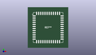

# OOMP Footprint  
## QFN102P1430X1430X251-48  by alexisvl  
  
oomp key: oomp_alexisvl_ipc7351_most_qfn102p1430x1430x251_48  
  
source repo at: [http://github.com/cpavlina/kicad-pcblib/blob/master/tmp/data/oomlout_oomp_footprint_src/smd-semi.pretty/VQFN50P230X230X100-12.kicad_mod](http://github.com/cpavlina/kicad-pcblib/blob/master/tmp/data/oomlout_oomp_footprint_src/smd-semi.pretty/VQFN50P230X230X100-12.kicad_mod)  
## Footprint  
  
  
  
  
| name | value | 
| --- | --- | 
| footprint name | QFN102P1430X1430X251-48 | 
| footprint description | QFN,1.02mm pitch,square;12 pin X 12 pin, 14.31mm X 14.31mm X 2.51mm H | 
| number of pads | 48 | 
| github path | http://github.com/cpavlina/kicad-pcblib/blob/master/tmp/data/oomlout_oomp_footprint_src/IPC7351-Most.pretty/QFN102P1430X1430X251-48.kicad_mod | 
| oomp key | oomp_alexisvl_ipc7351_most_qfn102p1430x1430x251_48 | 
| oomp bot github | https://github.com/oomlout/oomlout_oomp_footprint_bot/tree/main/tmp/data/oomlout_oomp_footprint_src/footprints/alexisvl_ipc7351_most_qfn102p1430x1430x251_48/working | 
## Images  
  
  
  
  
  
  
  
  
