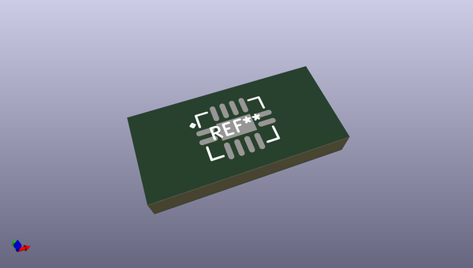
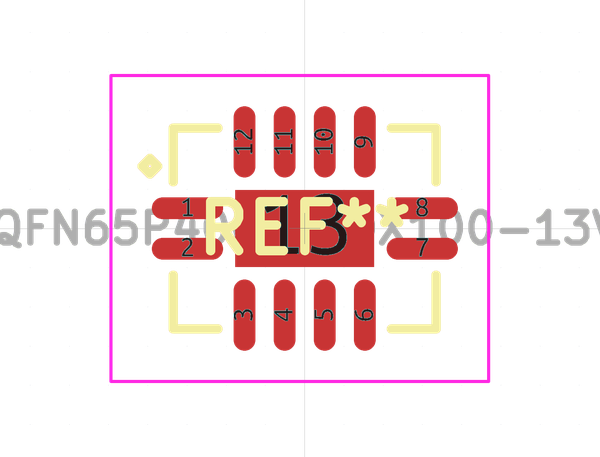
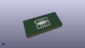

# OOMP Footprint  
## QFN65P400X300X100-13V  by alexisvl  
  
oomp key: oomp_alexisvl_ipc7351_most_qfn65p400x300x100_13v  
  
source repo at: [http://github.com/cpavlina/kicad-pcblib/blob/master/tmp/data//oomlout_oomp_footprint_src/smd-semi.pretty/VQFN50P230X230X100-12.kicad_mod](http://github.com/cpavlina/kicad-pcblib/blob/master/tmp/data//oomlout_oomp_footprint_src/smd-semi.pretty/VQFN50P230X230X100-12.kicad_mod)  
## Footprint  
  
  
  
  
| name | value | 
| --- | --- | 
| footprint name | QFN65P400X300X100-13V | 
| footprint description | QFN,0.65mm pitch,rect.,Pin 1 on short dimension;4 pin X 2 pin,4.00mm X 3.00mm X 1.00mm H (w/thermal tab) | 
| number of pads | 13 | 
| github path | http://github.com/cpavlina/kicad-pcblib/blob/master/tmp/data//oomlout_oomp_footprint_src/IPC7351-Most.pretty/QFN65P400X300X100-13V.kicad_mod | 
| oomp key | oomp_alexisvl_ipc7351_most_qfn65p400x300x100_13v | 
| oomp bot github | https://github.com/oomlout/oomlout_oomp_footprint_bot/tree/main/tmp/data//oomlout_oomp_footprint_src/footprints/alexisvl_ipc7351_most_qfn65p400x300x100_13v/working | 
## Images  
  
  
  
  
  
  
  
  
