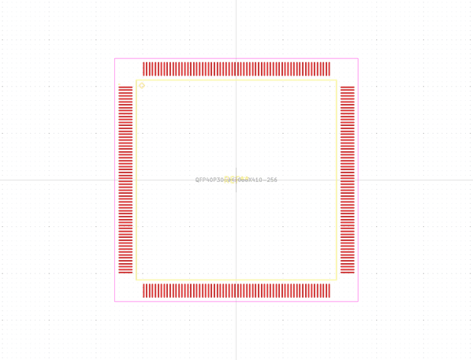
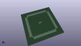
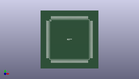

# OOMP Footprint  
## QFP40P3060X3060X410-256  by alexisvl  
  
oomp key: oomp_alexisvl_ipc7351_most_qfp40p3060x3060x410_256  
  
source repo at: [http://github.com/cpavlina/kicad-pcblib/blob/master/tmp/data//oomlout_oomp_footprint_src/smd-semi.pretty/VQFN50P230X230X100-12.kicad_mod](http://github.com/cpavlina/kicad-pcblib/blob/master/tmp/data//oomlout_oomp_footprint_src/smd-semi.pretty/VQFN50P230X230X100-12.kicad_mod)  
## Footprint  
  
  
  
  
| name | value | 
| --- | --- | 
| footprint name | QFP40P3060X3060X410-256 | 
| footprint description | QFP,0.40mm pitch,square;64 pin X 64 pin, 28.20mm X 28.20mm X 4.10mm H Body | 
| number of pads | 256 | 
| github path | http://github.com/cpavlina/kicad-pcblib/blob/master/tmp/data//oomlout_oomp_footprint_src/IPC7351-Most.pretty/QFP40P3060X3060X410-256.kicad_mod | 
| oomp key | oomp_alexisvl_ipc7351_most_qfp40p3060x3060x410_256 | 
| oomp bot github | https://github.com/oomlout/oomlout_oomp_footprint_bot/tree/main/tmp/data//oomlout_oomp_footprint_src/footprints/alexisvl_ipc7351_most_qfp40p3060x3060x410_256/working | 
## Images  
  
  
  
  
  
  
