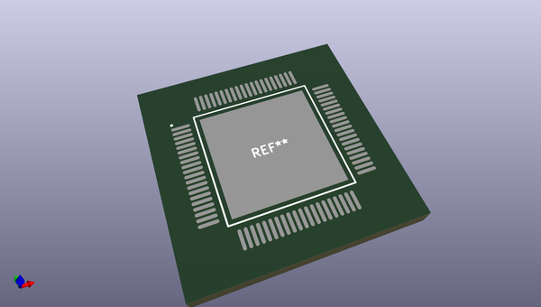
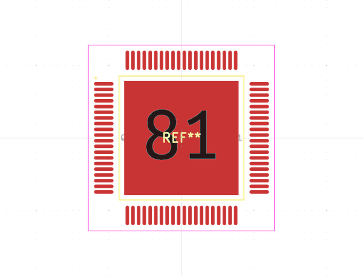
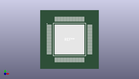

# OOMP Footprint  
## QFP50P1400X1400X120-81  by alexisvl  
  
oomp key: oomp_alexisvl_ipc7351_most_qfp50p1400x1400x120_81  
  
source repo at: [http://github.com/cpavlina/kicad-pcblib/blob/master/tmp/data/oomlout_oomp_footprint_src/smd-semi.pretty/VQFN50P230X230X100-12.kicad_mod](http://github.com/cpavlina/kicad-pcblib/blob/master/tmp/data/oomlout_oomp_footprint_src/smd-semi.pretty/VQFN50P230X230X100-12.kicad_mod)  
## Footprint  
  
  
  
  
| name | value | 
| --- | --- | 
| footprint name | QFP50P1400X1400X120-81 | 
| footprint description | QFP,0.50mm pitch,square;20 pin X 20 pin, 12.00mm X 12.00mm X 1.20mm H Body (w/thermal tab) | 
| number of pads | 81 | 
| github path | http://github.com/cpavlina/kicad-pcblib/blob/master/tmp/data/oomlout_oomp_footprint_src/IPC7351-Most.pretty/QFP50P1400X1400X120-81.kicad_mod | 
| oomp key | oomp_alexisvl_ipc7351_most_qfp50p1400x1400x120_81 | 
| oomp bot github | https://github.com/oomlout/oomlout_oomp_footprint_bot/tree/main/tmp/data/oomlout_oomp_footprint_src/footprints/alexisvl_ipc7351_most_qfp50p1400x1400x120_81/working | 
## Images  
  
  
  
  
  
  
  
  
