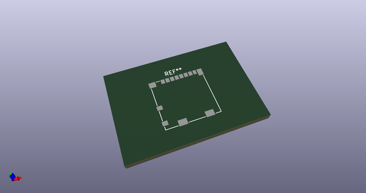
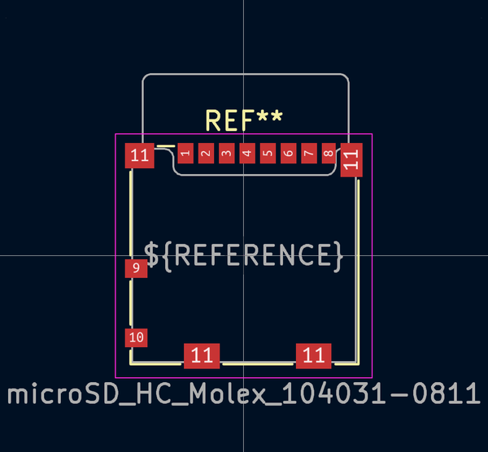
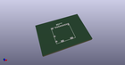
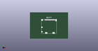

# OOMP Footprint  
## microSD_HC_Molex_104031-0811  by none  
  
oomp key: oomp_iangitpers_connector_card_microsd_hc_molex_104031_0811  
  
source repo at: [http://gitlab.com/Iangitpers/4a/blob/master/tmp/data//oomlout_oomp_footprint_src/TYPE-C-31-M-12/HRO_TYPE-C-31-M-12.kicad_mod](http://gitlab.com/Iangitpers/4a/blob/master/tmp/data//oomlout_oomp_footprint_src/TYPE-C-31-M-12/HRO_TYPE-C-31-M-12.kicad_mod)  
## Footprint  
  
  
  
  
| name | value | 
| --- | --- | 
| footprint name | microSD_HC_Molex_104031-0811 | 
| footprint description | 1.10mm Pitch microSD Memory Card Connector, Surface Mount, Push-Pull Type, 1.42mm Height, with Detect Switch (https://www.molex.com/pdm_docs/sd/1040310811_sd.pdf) | 
| number of pads | 14 | 
| github path | http://github.com/Iangitpers/4a/blob/master/tmp/data//oomlout_oomp_footprint_src/Connector_Card.pretty/microSD_HC_Molex_104031-0811.kicad_mod | 
| oomp key | oomp_iangitpers_connector_card_microsd_hc_molex_104031_0811 | 
| oomp bot github | https://github.com/oomlout/oomlout_oomp_footprint_bot/tree/main/tmp/data//oomlout_oomp_footprint_src/footprints/iangitpers_connector_card_microsd_hc_molex_104031_0811/working | 
## Images  
  
  
  
  
  
  
