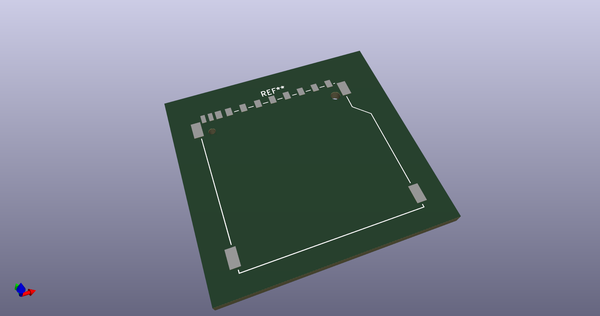
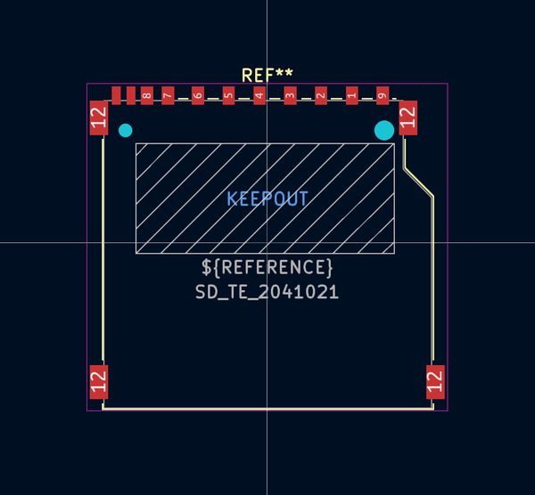
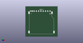

# OOMP Footprint  
## SD_TE_2041021  by none  
  
oomp key: oomp_iangitpers_connector_card_sd_te_2041021  
  
source repo at: [http://gitlab.com/Iangitpers/4a/blob/master/tmp/data//oomlout_oomp_footprint_src/TYPE-C-31-M-12/HRO_TYPE-C-31-M-12.kicad_mod](http://gitlab.com/Iangitpers/4a/blob/master/tmp/data//oomlout_oomp_footprint_src/TYPE-C-31-M-12/HRO_TYPE-C-31-M-12.kicad_mod)  
## Footprint  
  
  
  
  
| name | value | 
| --- | --- | 
| footprint name | SD_TE_2041021 | 
| footprint description | SD card connector, top mount, SMT (http://www.te.com/commerce/DocumentDelivery/DDEController?Action=showdoc&DocId=Customer+Drawing%7F2041021%7FB%7Fpdf%7FEnglish%7FENG_CD_2041021_B_C_2041021_B.pdf%7F2041021-4) | 
| number of pads | 17 | 
| github path | http://github.com/Iangitpers/4a/blob/master/tmp/data//oomlout_oomp_footprint_src/Connector_Card.pretty/SD_TE_2041021.kicad_mod | 
| oomp key | oomp_iangitpers_connector_card_sd_te_2041021 | 
| oomp bot github | https://github.com/oomlout/oomlout_oomp_footprint_bot/tree/main/tmp/data//oomlout_oomp_footprint_src/footprints/iangitpers_connector_card_sd_te_2041021/working | 
## Images  
  
  
  
  
  
  
