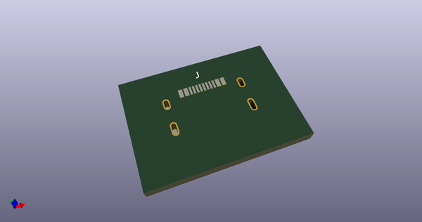
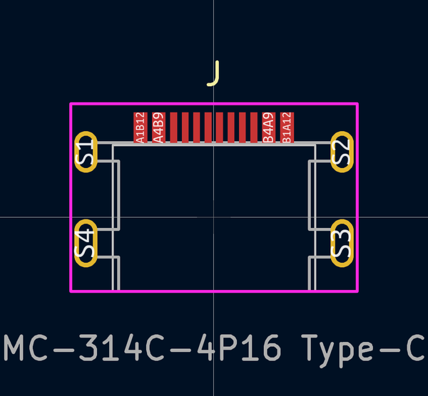
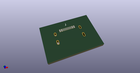
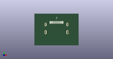

# OOMP Footprint  
## MC-314C-4P16_Type-C  by none  
  
oomp key: oomp_iangitpers_dp_usb_mc_314c_4p16_type_c  
  
source repo at: [http://gitlab.com/Iangitpers/4a/blob/master/tmp/data//oomlout_oomp_footprint_src/TYPE-C-31-M-12/HRO_TYPE-C-31-M-12.kicad_mod](http://gitlab.com/Iangitpers/4a/blob/master/tmp/data//oomlout_oomp_footprint_src/TYPE-C-31-M-12/HRO_TYPE-C-31-M-12.kicad_mod)  
## Footprint  
  
  
  
  
| name | value | 
| --- | --- | 
| footprint name | MC-314C-4P16_Type-C | 
| footprint description | USB Type-C PCB recessed, 3.25 mm from board edge | 
| number of pads | 16 | 
| github path | http://github.com/Iangitpers/4a/blob/master/tmp/data//oomlout_oomp_footprint_src/dp-usb/dp-usb.pretty/MC-314C-4P16_Type-C.kicad_mod | 
| oomp key | oomp_iangitpers_dp_usb_mc_314c_4p16_type_c | 
| oomp bot github | https://github.com/oomlout/oomlout_oomp_footprint_bot/tree/main/tmp/data//oomlout_oomp_footprint_src/footprints/iangitpers_dp_usb_mc_314c_4p16_type_c/working | 
## Images  
  
  
  
  
  
  
  
  
