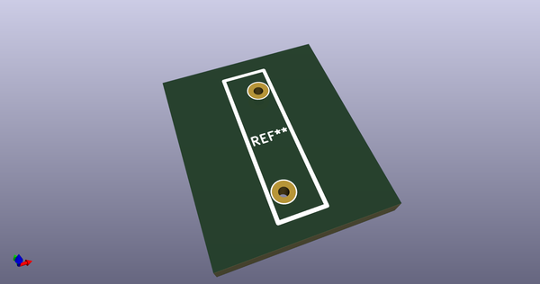
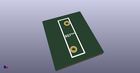

# OOMP Footprint  
## LITTELFUSE-30R500  by none  
  
oomp key: oomp_iangitpers_manuf_littelfuse_30r500  
  
source repo at: [http://gitlab.com/Iangitpers/4a/blob/master/tmp/data//oomlout_oomp_footprint_src/TYPE-C-31-M-12/HRO_TYPE-C-31-M-12.kicad_mod](http://gitlab.com/Iangitpers/4a/blob/master/tmp/data//oomlout_oomp_footprint_src/TYPE-C-31-M-12/HRO_TYPE-C-31-M-12.kicad_mod)  
## Footprint  
  
  
  
  
| name | value | 
| --- | --- | 
| footprint name | LITTELFUSE-30R500 | 
| footprint description | None | 
| number of pads | 2 | 
| github path | http://github.com/Iangitpers/4a/blob/master/tmp/data//oomlout_oomp_footprint_src/manuf.pretty/LITTELFUSE-30R500.kicad_mod | 
| oomp key | oomp_iangitpers_manuf_littelfuse_30r500 | 
| oomp bot github | https://github.com/oomlout/oomlout_oomp_footprint_bot/tree/main/tmp/data//oomlout_oomp_footprint_src/footprints/iangitpers_manuf_littelfuse_30r500/working | 
## Images  
  
  
  
  
  
  
  
  
