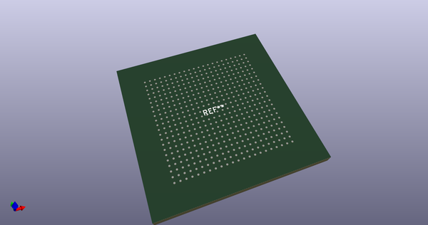
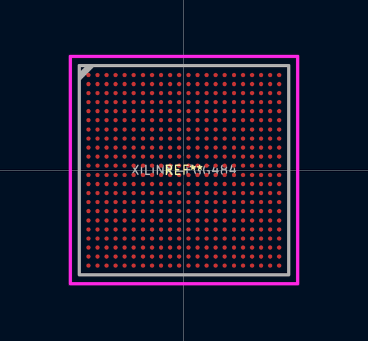
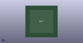

# OOMP Footprint  
## XILINX-FGG484  by none  
  
oomp key: oomp_iangitpers_manuf_xilinx_fgg484  
  
source repo at: [http://gitlab.com/Iangitpers/4a/blob/master/tmp/data//oomlout_oomp_footprint_src/TYPE-C-31-M-12/HRO_TYPE-C-31-M-12.kicad_mod](http://gitlab.com/Iangitpers/4a/blob/master/tmp/data//oomlout_oomp_footprint_src/TYPE-C-31-M-12/HRO_TYPE-C-31-M-12.kicad_mod)  
## Footprint  
  
  
  
  
| name | value | 
| --- | --- | 
| footprint name | XILINX-FGG484 | 
| footprint description | None | 
| number of pads | 484 | 
| github path | http://github.com/Iangitpers/4a/blob/master/tmp/data//oomlout_oomp_footprint_src/manuf.pretty/XILINX-FGG484.kicad_mod | 
| oomp key | oomp_iangitpers_manuf_xilinx_fgg484 | 
| oomp bot github | https://github.com/oomlout/oomlout_oomp_footprint_bot/tree/main/tmp/data//oomlout_oomp_footprint_src/footprints/iangitpers_manuf_xilinx_fgg484/working | 
## Images  
  
  
  
  
  
  
  
  
