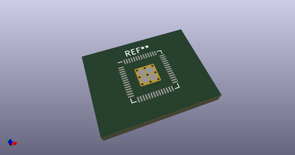
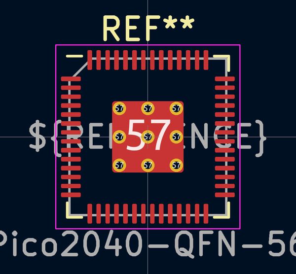
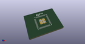
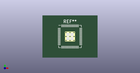

# OOMP Footprint  
## RP2040-QFN-56  by none  
  
oomp key: oomp_iangitpers_mcu_raspberrypi_and_boards_rp2040_qfn_56  
  
source repo at: [http://gitlab.com/Iangitpers/4a/blob/master/tmp/data//oomlout_oomp_footprint_src/TYPE-C-31-M-12/HRO_TYPE-C-31-M-12.kicad_mod](http://gitlab.com/Iangitpers/4a/blob/master/tmp/data//oomlout_oomp_footprint_src/TYPE-C-31-M-12/HRO_TYPE-C-31-M-12.kicad_mod)  
## Footprint  
  
  
  
  
| name | value | 
| --- | --- | 
| footprint name | RP2040-QFN-56 | 
| footprint description | QFN, 56 Pin (http://www.cypress.com/file/416486/download#page=40), generated with kicad-footprint-generator ipc_dfn_qfn_generator.py | 
| number of pads | 70 | 
| github path | http://github.com/Iangitpers/4a/blob/master/tmp/data//oomlout_oomp_footprint_src/RP_Silicon_KiCad-main/KiCadLibraries/MCU_RaspberryPi_and_Boards.pretty/RP2040-QFN-56.kicad_mod | 
| oomp key | oomp_iangitpers_mcu_raspberrypi_and_boards_rp2040_qfn_56 | 
| oomp bot github | https://github.com/oomlout/oomlout_oomp_footprint_bot/tree/main/tmp/data//oomlout_oomp_footprint_src/footprints/iangitpers_mcu_raspberrypi_and_boards_rp2040_qfn_56/working | 
## Images  
  
  
  
  
  
  
  
  
