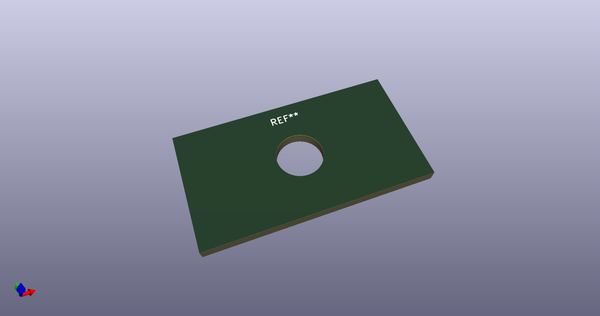
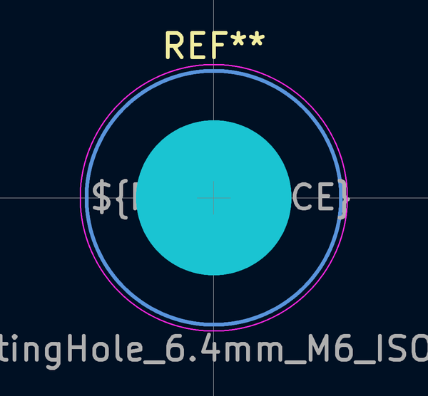
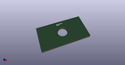

# OOMP Footprint  
## MountingHole_6.4mm_M6_ISO7380  by none  
  
oomp key: oomp_iangitpers_mountinghole_mountinghole_6_4mm_m6_iso7380  
  
source repo at: [http://gitlab.com/Iangitpers/4a/blob/master/tmp/data//oomlout_oomp_footprint_src/TYPE-C-31-M-12/HRO_TYPE-C-31-M-12.kicad_mod](http://gitlab.com/Iangitpers/4a/blob/master/tmp/data//oomlout_oomp_footprint_src/TYPE-C-31-M-12/HRO_TYPE-C-31-M-12.kicad_mod)  
## Footprint  
  
  
  
  
| name | value | 
| --- | --- | 
| footprint name | MountingHole_6.4mm_M6_ISO7380 | 
| footprint description | Mounting Hole 6.4mm, no annular, M6, ISO7380 | 
| number of pads | 1 | 
| github path | http://github.com/Iangitpers/4a/blob/master/tmp/data//oomlout_oomp_footprint_src/MountingHole.pretty/MountingHole_6.4mm_M6_ISO7380.kicad_mod | 
| oomp key | oomp_iangitpers_mountinghole_mountinghole_6_4mm_m6_iso7380 | 
| oomp bot github | https://github.com/oomlout/oomlout_oomp_footprint_bot/tree/main/tmp/data//oomlout_oomp_footprint_src/footprints/iangitpers_mountinghole_mountinghole_6_4mm_m6_iso7380/working | 
## Images  
  
  
  
  
  
  
  
  
