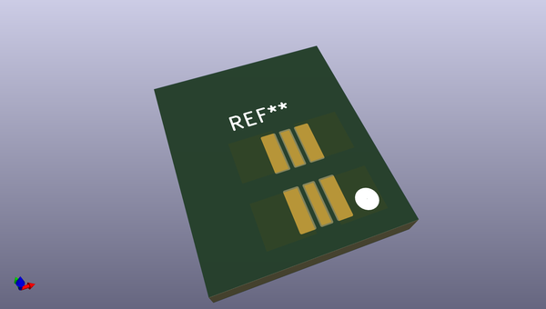
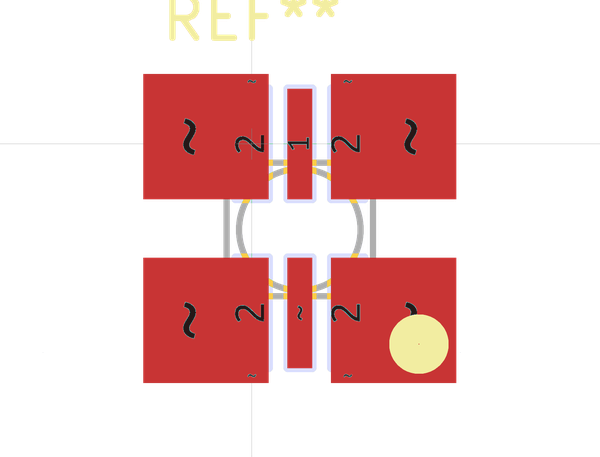
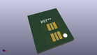
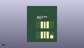

# OOMP Footprint  
## LED_LW_G6SP  by kicad-harryr  
  
oomp key: oomp_kicad_harryr_rx_viper_led_lw_g6sp  
  
source repo at: [http://github.com/kicad-harryr/rx-viper.pretty/blob/master/tmp/data/oomlout_oomp_footprint_src/pam2306.kicad_mod](http://github.com/kicad-harryr/rx-viper.pretty/blob/master/tmp/data/oomlout_oomp_footprint_src/pam2306.kicad_mod)  
## Footprint  
  
  
  
  
| name | value | 
| --- | --- | 
| footprint name | LED_LW_G6SP | 
| footprint description | None | 
| number of pads | 14 | 
| github path | http://github.com/kicad-harryr/rx-viper.pretty/blob/master/tmp/data/oomlout_oomp_footprint_src/LED_LW_G6SP.kicad_mod | 
| oomp key | oomp_kicad_harryr_rx_viper_led_lw_g6sp | 
| oomp bot github | https://github.com/oomlout/oomlout_oomp_footprint_bot/tree/main/tmp/data/oomlout_oomp_footprint_src/footprints/kicad_harryr_rx_viper_led_lw_g6sp/working | 
## Images  
  
  
  
  
  
  
  
  
