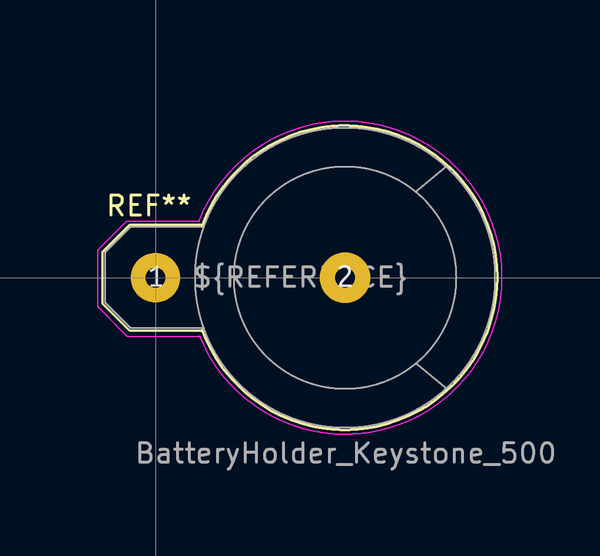
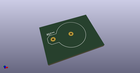

# OOMP Footprint  
## BatteryHolder_Keystone_500  by none  
  
oomp key: oomp_kicad_battery_batteryholder_keystone_500  
  
source repo at: [http://gitlab.com/kicad/kicad-footprints/blob/master/tmp/data//oomlout_oomp_footprint_src/Varistor.pretty/RV_Rect_V25S440P_L26.5mm_W8.2mm_P12.7mm.kicad_mod](http://gitlab.com/kicad/kicad-footprints/blob/master/tmp/data//oomlout_oomp_footprint_src/Varistor.pretty/RV_Rect_V25S440P_L26.5mm_W8.2mm_P12.7mm.kicad_mod)  
## Footprint  
  
  
  
  
| name | value | 
| --- | --- | 
| footprint name | BatteryHolder_Keystone_500 | 
| footprint description | Keystone #500, 12mm CR1220 battery holder, http://www.keyelco.com/product-pdf.cfm?p=710 | 
| number of pads | 2 | 
| github path | http://github.com/kicad/kicad-footprints/blob/master/tmp/data//oomlout_oomp_footprint_src/Battery.pretty/BatteryHolder_Keystone_500.kicad_mod | 
| oomp key | oomp_kicad_battery_batteryholder_keystone_500 | 
| oomp bot github | https://github.com/oomlout/oomlout_oomp_footprint_bot/tree/main/tmp/data//oomlout_oomp_footprint_src/footprints/kicad_battery_batteryholder_keystone_500/working | 
## Images  
  
  
  
  
  
  
