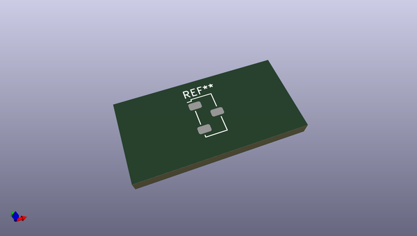
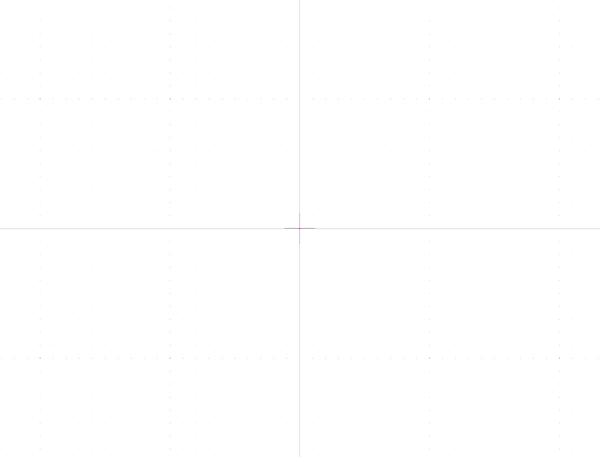

# OOMP Footprint  
## Nidec_Copal_CAS-120A  by none  
  
oomp key: oomp_kicad_button_switch_smd_nidec_copal_cas_120a  
  
source repo at: [http://gitlab.com/kicad/kicad-footprints/blob/master/tmp/data//oomlout_oomp_footprint_src/Varistor.pretty/RV_Rect_V25S440P_L26.5mm_W8.2mm_P12.7mm.kicad_mod](http://gitlab.com/kicad/kicad-footprints/blob/master/tmp/data//oomlout_oomp_footprint_src/Varistor.pretty/RV_Rect_V25S440P_L26.5mm_W8.2mm_P12.7mm.kicad_mod)  
## Footprint  
  
  
  
  
| name | value | 
| --- | --- | 
| footprint name | Nidec_Copal_CAS-120A | 
| footprint description | Slide Switch, SMD, Nidec CAS series, https://www.nidec-components.com/e/catalog/switch/cas.pdf | 
| number of pads | 3 | 
| github path | http://github.com/kicad/kicad-footprints/blob/master/tmp/data//oomlout_oomp_footprint_src/Button_Switch_SMD.pretty/Nidec_Copal_CAS-120A.kicad_mod | 
| oomp key | oomp_kicad_button_switch_smd_nidec_copal_cas_120a | 
| oomp bot github | https://github.com/oomlout/oomlout_oomp_footprint_bot/tree/main/tmp/data//oomlout_oomp_footprint_src/footprints/kicad_button_switch_smd_nidec_copal_cas_120a/working | 
## Images  
