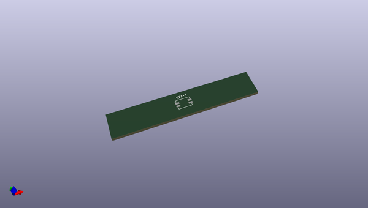
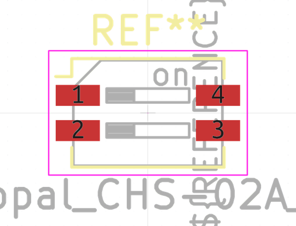
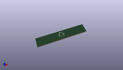

# OOMP Footprint  
## SW_DIP_SPSTx02_Slide_Copal_CHS-02A_W5.08mm_P1.27mm_JPin  by none  
  
oomp key: oomp_kicad_button_switch_smd_sw_dip_spstx02_slide_copal_chs_02a_w5_08mm_p1_27mm_jpin  
  
source repo at: [http://gitlab.com/kicad/kicad-footprints/blob/master/tmp/data//oomlout_oomp_footprint_src/Varistor.pretty/RV_Rect_V25S440P_L26.5mm_W8.2mm_P12.7mm.kicad_mod](http://gitlab.com/kicad/kicad-footprints/blob/master/tmp/data//oomlout_oomp_footprint_src/Varistor.pretty/RV_Rect_V25S440P_L26.5mm_W8.2mm_P12.7mm.kicad_mod)  
## Footprint  
  
  
  
  
| name | value | 
| --- | --- | 
| footprint name | SW_DIP_SPSTx02_Slide_Copal_CHS-02A_W5.08mm_P1.27mm_JPin | 
| footprint description | SMD 2x-dip-switch SPST Copal_CHS-02A, Slide, row spacing 5.08 mm (200 mils), body size  (see http://www.nidec-copal-electronics.com/e/catalog/switch/chs.pdf), SMD, JPin | 
| number of pads | 4 | 
| github path | http://github.com/kicad/kicad-footprints/blob/master/tmp/data//oomlout_oomp_footprint_src/Button_Switch_SMD.pretty/SW_DIP_SPSTx02_Slide_Copal_CHS-02A_W5.08mm_P1.27mm_JPin.kicad_mod | 
| oomp key | oomp_kicad_button_switch_smd_sw_dip_spstx02_slide_copal_chs_02a_w5_08mm_p1_27mm_jpin | 
| oomp bot github | https://github.com/oomlout/oomlout_oomp_footprint_bot/tree/main/tmp/data//oomlout_oomp_footprint_src/footprints/kicad_button_switch_smd_sw_dip_spstx02_slide_copal_chs_02a_w5_08mm_p1_27mm_jpin/working | 
## Images  
  
  
  
  
  
  
  
  
