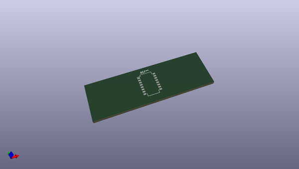
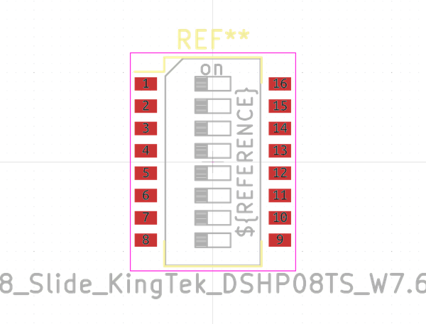
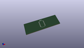

# OOMP Footprint  
## SW_DIP_SPSTx08_Slide_KingTek_DSHP08TS_W7.62mm_P1.27mm  by none  
  
oomp key: oomp_kicad_button_switch_smd_sw_dip_spstx08_slide_kingtek_dshp08ts_w7_62mm_p1_27mm  
  
source repo at: [http://gitlab.com/kicad/kicad-footprints/blob/master/tmp/data//oomlout_oomp_footprint_src/Varistor.pretty/RV_Rect_V25S440P_L26.5mm_W8.2mm_P12.7mm.kicad_mod](http://gitlab.com/kicad/kicad-footprints/blob/master/tmp/data//oomlout_oomp_footprint_src/Varistor.pretty/RV_Rect_V25S440P_L26.5mm_W8.2mm_P12.7mm.kicad_mod)  
## Footprint  
  
  
  
  
| name | value | 
| --- | --- | 
| footprint name | SW_DIP_SPSTx08_Slide_KingTek_DSHP08TS_W7.62mm_P1.27mm | 
| footprint description | SMD 8x-dip-switch SPST KingTek_DSHP08TS, Slide, row spacing 7.62 mm (300 mils), body size  (see http://www.kingtek.net.cn/pic/201601201417455112.pdf) | 
| number of pads | 16 | 
| github path | http://github.com/kicad/kicad-footprints/blob/master/tmp/data//oomlout_oomp_footprint_src/Button_Switch_SMD.pretty/SW_DIP_SPSTx08_Slide_KingTek_DSHP08TS_W7.62mm_P1.27mm.kicad_mod | 
| oomp key | oomp_kicad_button_switch_smd_sw_dip_spstx08_slide_kingtek_dshp08ts_w7_62mm_p1_27mm | 
| oomp bot github | https://github.com/oomlout/oomlout_oomp_footprint_bot/tree/main/tmp/data//oomlout_oomp_footprint_src/footprints/kicad_button_switch_smd_sw_dip_spstx08_slide_kingtek_dshp08ts_w7_62mm_p1_27mm/working | 
## Images  
  
  
  
  
  
  
  
  
