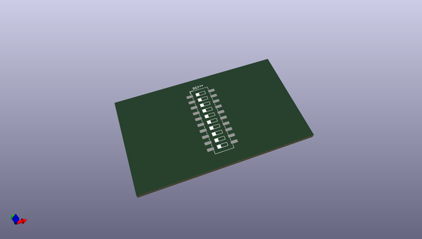
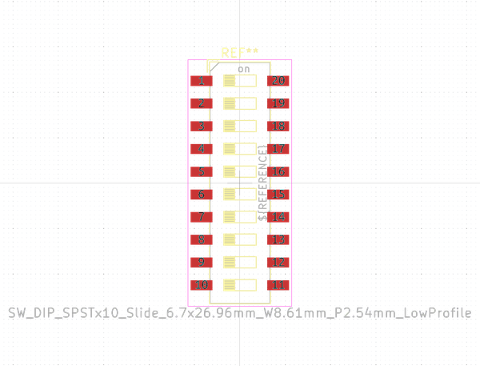
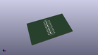

# OOMP Footprint  
## SW_DIP_SPSTx10_Slide_6.7x26.96mm_W8.61mm_P2.54mm_LowProfile  by none  
  
oomp key: oomp_kicad_button_switch_smd_sw_dip_spstx10_slide_6_7x26_96mm_w8_61mm_p2_54mm_lowprofile  
  
source repo at: [http://gitlab.com/kicad/kicad-footprints/blob/master/tmp/data//oomlout_oomp_footprint_src/Varistor.pretty/RV_Rect_V25S440P_L26.5mm_W8.2mm_P12.7mm.kicad_mod](http://gitlab.com/kicad/kicad-footprints/blob/master/tmp/data//oomlout_oomp_footprint_src/Varistor.pretty/RV_Rect_V25S440P_L26.5mm_W8.2mm_P12.7mm.kicad_mod)  
## Footprint  
  
  
  
  
| name | value | 
| --- | --- | 
| footprint name | SW_DIP_SPSTx10_Slide_6.7x26.96mm_W8.61mm_P2.54mm_LowProfile | 
| footprint description | SMD 10x-dip-switch SPST , Slide, row spacing 8.61 mm (338 mils), body size 6.7x26.96mm (see e.g. https://www.ctscorp.com/wp-content/uploads/219.pdf), SMD, LowProfile | 
| number of pads | 20 | 
| github path | http://github.com/kicad/kicad-footprints/blob/master/tmp/data//oomlout_oomp_footprint_src/Button_Switch_SMD.pretty/SW_DIP_SPSTx10_Slide_6.7x26.96mm_W8.61mm_P2.54mm_LowProfile.kicad_mod | 
| oomp key | oomp_kicad_button_switch_smd_sw_dip_spstx10_slide_6_7x26_96mm_w8_61mm_p2_54mm_lowprofile | 
| oomp bot github | https://github.com/oomlout/oomlout_oomp_footprint_bot/tree/main/tmp/data//oomlout_oomp_footprint_src/footprints/kicad_button_switch_smd_sw_dip_spstx10_slide_6_7x26_96mm_w8_61mm_p2_54mm_lowprofile/working | 
## Images  
  
  
  
  
  
  
  
  
