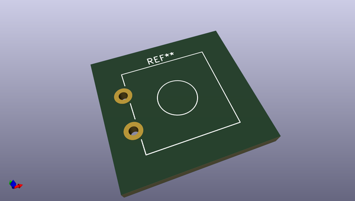
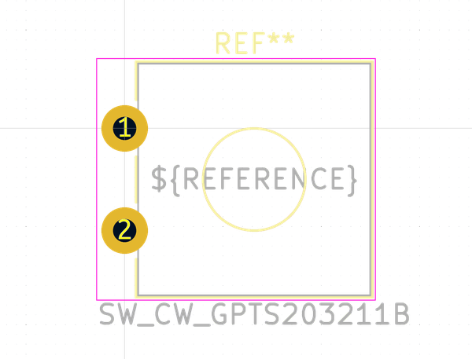

# OOMP Footprint  
## SW_CW_GPTS203211B  by none  
  
oomp key: oomp_kicad_button_switch_tht_sw_cw_gpts203211b  
  
source repo at: [http://gitlab.com/kicad/kicad-footprints/blob/master/tmp/data//oomlout_oomp_footprint_src/Varistor.pretty/RV_Rect_V25S440P_L26.5mm_W8.2mm_P12.7mm.kicad_mod](http://gitlab.com/kicad/kicad-footprints/blob/master/tmp/data//oomlout_oomp_footprint_src/Varistor.pretty/RV_Rect_V25S440P_L26.5mm_W8.2mm_P12.7mm.kicad_mod)  
## Footprint  
  
  
  
  
| name | value | 
| --- | --- | 
| footprint name | SW_CW_GPTS203211B | 
| footprint description | SPST Off-On Pushbutton, 1A, 30V, CW Industries P/N GPTS203211B, http://switches-connectors-custom.cwind.com/Asset/GPTS203211BR2.pdf | 
| number of pads | 2 | 
| github path | http://github.com/kicad/kicad-footprints/blob/master/tmp/data//oomlout_oomp_footprint_src/Button_Switch_THT.pretty/SW_CW_GPTS203211B.kicad_mod | 
| oomp key | oomp_kicad_button_switch_tht_sw_cw_gpts203211b | 
| oomp bot github | https://github.com/oomlout/oomlout_oomp_footprint_bot/tree/main/tmp/data//oomlout_oomp_footprint_src/footprints/kicad_button_switch_tht_sw_cw_gpts203211b/working | 
## Images  
  
  
  
  
  
  
  
  
