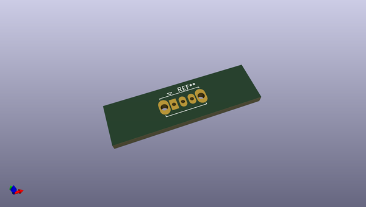
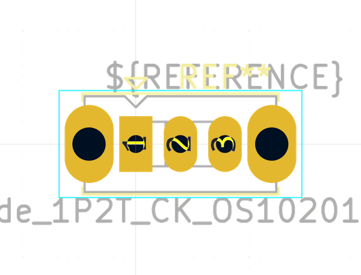
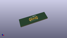

# OOMP Footprint  
## SW_Slide_1P2T_CK_OS102011MS2Q  by none  
  
oomp key: oomp_kicad_button_switch_tht_sw_slide_1p2t_ck_os102011ms2q  
  
source repo at: [http://gitlab.com/kicad/kicad-footprints/blob/master/tmp/data//oomlout_oomp_footprint_src/Varistor.pretty/RV_Rect_V25S440P_L26.5mm_W8.2mm_P12.7mm.kicad_mod](http://gitlab.com/kicad/kicad-footprints/blob/master/tmp/data//oomlout_oomp_footprint_src/Varistor.pretty/RV_Rect_V25S440P_L26.5mm_W8.2mm_P12.7mm.kicad_mod)  
## Footprint  
  
  
  
  
| name | value | 
| --- | --- | 
| footprint name | SW_Slide_1P2T_CK_OS102011MS2Q | 
| footprint description | CuK miniature slide switch, OS series, SPDT, https://www.ckswitches.com/media/1428/os.pdf | 
| number of pads | 5 | 
| github path | http://github.com/kicad/kicad-footprints/blob/master/tmp/data//oomlout_oomp_footprint_src/Button_Switch_THT.pretty/SW_Slide_1P2T_CK_OS102011MS2Q.kicad_mod | 
| oomp key | oomp_kicad_button_switch_tht_sw_slide_1p2t_ck_os102011ms2q | 
| oomp bot github | https://github.com/oomlout/oomlout_oomp_footprint_bot/tree/main/tmp/data//oomlout_oomp_footprint_src/footprints/kicad_button_switch_tht_sw_slide_1p2t_ck_os102011ms2q/working | 
## Images  
  
  
  
  
  
  
  
  
