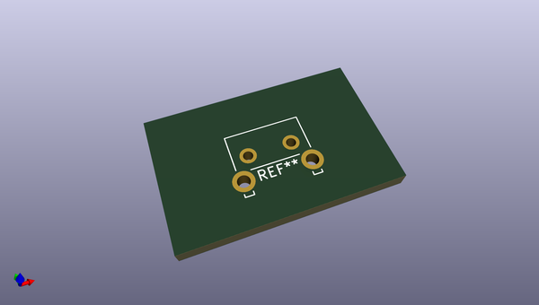
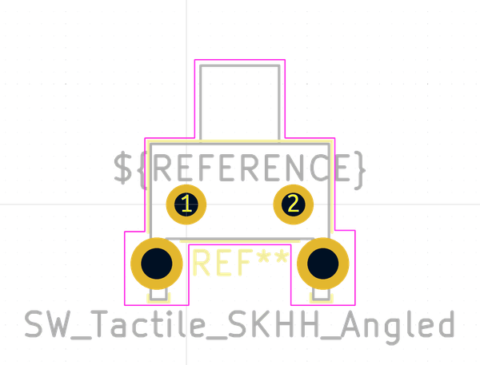
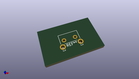
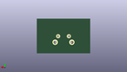
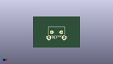

# OOMP Footprint  
## SW_Tactile_SKHH_Angled  by none  
  
oomp key: oomp_kicad_button_switch_tht_sw_tactile_skhh_angled  
  
source repo at: [http://gitlab.com/kicad/kicad-footprints/blob/master/tmp/data//oomlout_oomp_footprint_src/Varistor.pretty/RV_Rect_V25S440P_L26.5mm_W8.2mm_P12.7mm.kicad_mod](http://gitlab.com/kicad/kicad-footprints/blob/master/tmp/data//oomlout_oomp_footprint_src/Varistor.pretty/RV_Rect_V25S440P_L26.5mm_W8.2mm_P12.7mm.kicad_mod)  
## Footprint  
  
  
  
  
| name | value | 
| --- | --- | 
| footprint name | SW_Tactile_SKHH_Angled | 
| footprint description | tactile switch 6mm ALPS SKHH right angle http://www.alps.com/prod/info/E/HTML/Tact/SnapIn/SKHH/SKHHLUA010.html | 
| number of pads | 4 | 
| github path | http://github.com/kicad/kicad-footprints/blob/master/tmp/data//oomlout_oomp_footprint_src/Button_Switch_THT.pretty/SW_Tactile_SKHH_Angled.kicad_mod | 
| oomp key | oomp_kicad_button_switch_tht_sw_tactile_skhh_angled | 
| oomp bot github | https://github.com/oomlout/oomlout_oomp_footprint_bot/tree/main/tmp/data//oomlout_oomp_footprint_src/footprints/kicad_button_switch_tht_sw_tactile_skhh_angled/working | 
## Images  
  
  
  
  
  
  
  
  
