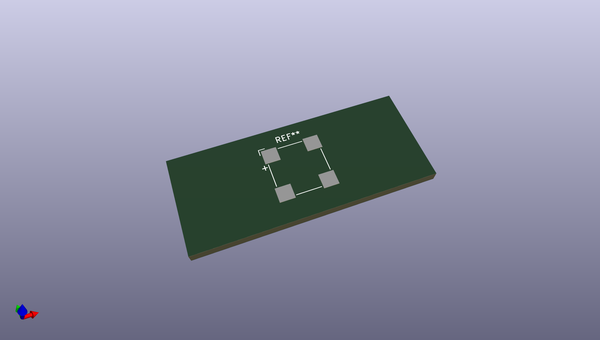
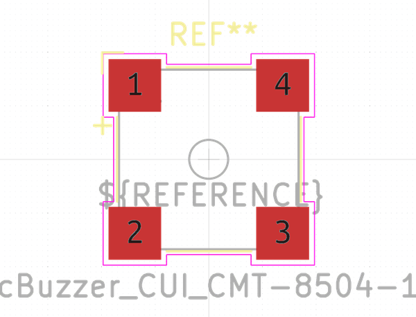
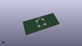

# OOMP Footprint  
## MagneticBuzzer_CUI_CMT-8504-100-SMT  by none  
  
oomp key: oomp_kicad_buzzer_beeper_magneticbuzzer_cui_cmt_8504_100_smt  
  
source repo at: [http://gitlab.com/kicad/kicad-footprints/blob/master/tmp/data//oomlout_oomp_footprint_src/Varistor.pretty/RV_Rect_V25S440P_L26.5mm_W8.2mm_P12.7mm.kicad_mod](http://gitlab.com/kicad/kicad-footprints/blob/master/tmp/data//oomlout_oomp_footprint_src/Varistor.pretty/RV_Rect_V25S440P_L26.5mm_W8.2mm_P12.7mm.kicad_mod)  
## Footprint  
  
  
  
  
| name | value | 
| --- | --- | 
| footprint name | MagneticBuzzer_CUI_CMT-8504-100-SMT | 
| footprint description | magnetic transducer buzzer, 5V, SPL of 100 dB at 10 cm, https://www.cuidevices.com/product/resource/pdf/cmt-8504-100-smt-tr.pdf | 
| number of pads | 4 | 
| github path | http://github.com/kicad/kicad-footprints/blob/master/tmp/data//oomlout_oomp_footprint_src/Buzzer_Beeper.pretty/MagneticBuzzer_CUI_CMT-8504-100-SMT.kicad_mod | 
| oomp key | oomp_kicad_buzzer_beeper_magneticbuzzer_cui_cmt_8504_100_smt | 
| oomp bot github | https://github.com/oomlout/oomlout_oomp_footprint_bot/tree/main/tmp/data//oomlout_oomp_footprint_src/footprints/kicad_buzzer_beeper_magneticbuzzer_cui_cmt_8504_100_smt/working | 
## Images  
  
  
  
  
  
  
  
  
