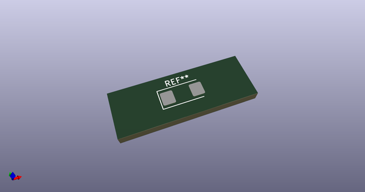
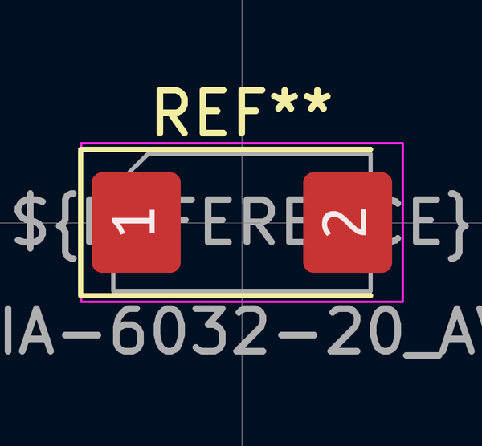
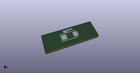

# OOMP Footprint  
## CP_EIA-6032-20_AVX-F  by none  
  
oomp key: oomp_kicad_capacitor_tantalum_smd_cp_eia_6032_20_avx_f  
  
source repo at: [http://gitlab.com/kicad/kicad-footprints/blob/master/tmp/data//oomlout_oomp_footprint_src/Varistor.pretty/RV_Rect_V25S440P_L26.5mm_W8.2mm_P12.7mm.kicad_mod](http://gitlab.com/kicad/kicad-footprints/blob/master/tmp/data//oomlout_oomp_footprint_src/Varistor.pretty/RV_Rect_V25S440P_L26.5mm_W8.2mm_P12.7mm.kicad_mod)  
## Footprint  
  
  
  
  
| name | value | 
| --- | --- | 
| footprint name | CP_EIA-6032-20_AVX-F | 
| footprint description | Tantalum Capacitor SMD AVX-F (6032-20 Metric), IPC_7351 nominal, (Body size from: http://www.kemet.com/Lists/ProductCatalog/Attachments/253/KEM_TC101_STD.pdf), generated with kicad-footprint-generator | 
| number of pads | 2 | 
| github path | http://github.com/kicad/kicad-footprints/blob/master/tmp/data//oomlout_oomp_footprint_src/Capacitor_Tantalum_SMD.pretty/CP_EIA-6032-20_AVX-F.kicad_mod | 
| oomp key | oomp_kicad_capacitor_tantalum_smd_cp_eia_6032_20_avx_f | 
| oomp bot github | https://github.com/oomlout/oomlout_oomp_footprint_bot/tree/main/tmp/data//oomlout_oomp_footprint_src/footprints/kicad_capacitor_tantalum_smd_cp_eia_6032_20_avx_f/working | 
## Images  
  
  
  
  
  
  
  
  
